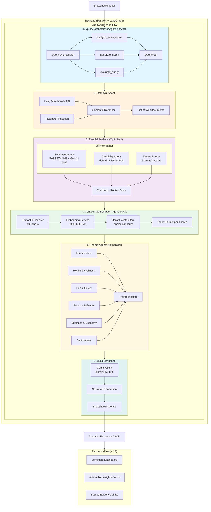
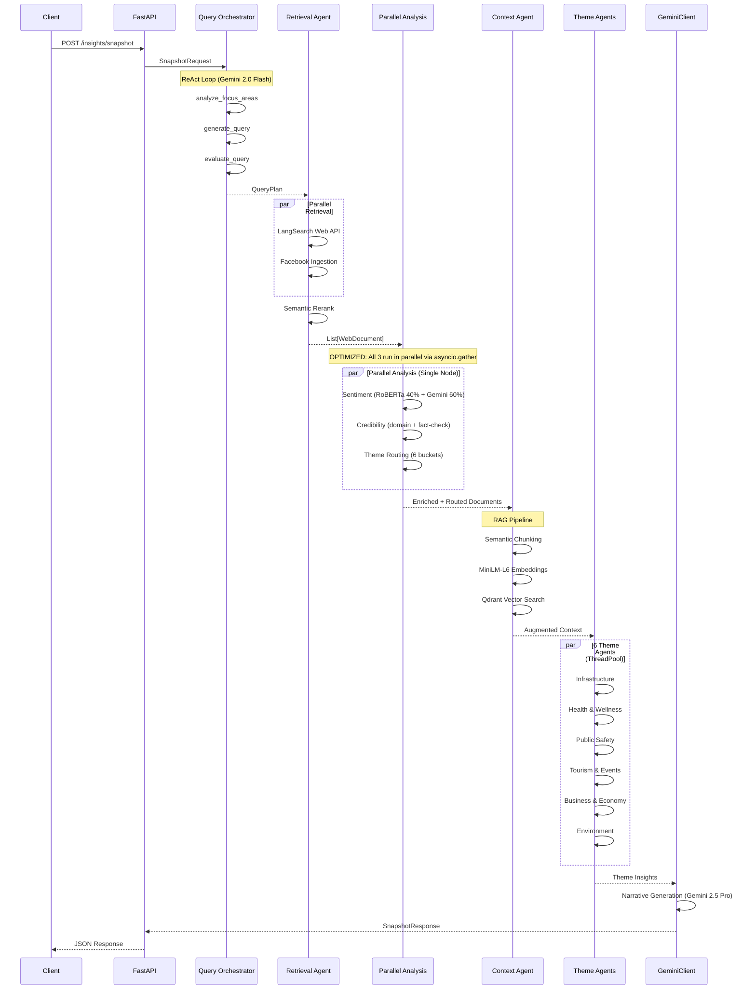
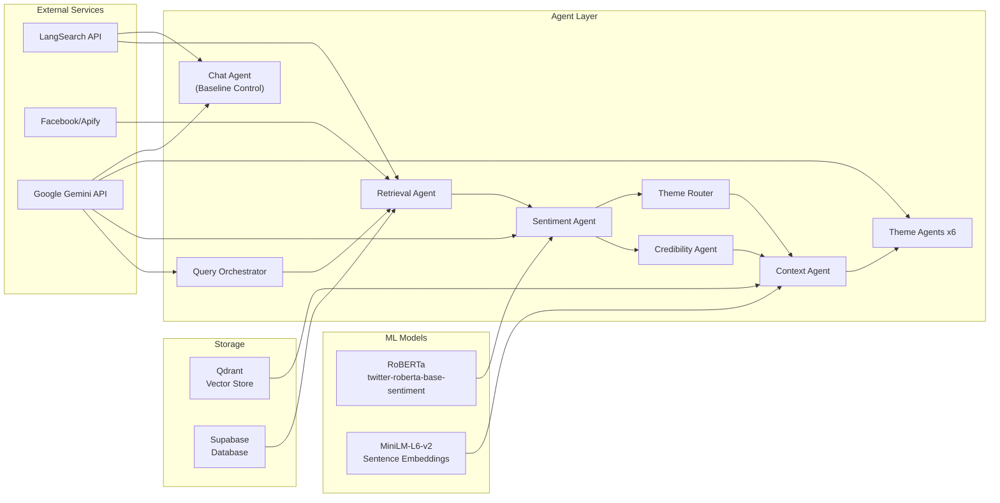

# Hinaing System Architecture

## Overview

Multi-Agentic AI system with real-time intelligent search and RAG for context-aware public opinion analysis in Baguio City.

## Agent Count Summary

| Category | Agents | Notes |
|----------|--------|-------|
| **Core Pipeline Agents** | 6 | Query Orchestrator, Retrieval, Sentiment, Credibility, Context, Theme Router |
| **Theme Sub-Agents** | 6 | Infrastructure, Health, Safety, Tourism, Economy, Environment |
| **Total** | **12** | 6 main + 6 theme-specific |

> **Optimization Note**: Sentiment, Credibility, and Theme Router agents now run **in parallel** via `asyncio.gather`, reducing latency from ~88s to ~54s while maintaining the same agent count.

## LLM Configuration

| Component | Model | Reason |
|-----------|-------|--------|
| **Narrative Summary** | `gemini-2.5-pro` | Comprehensive topic coverage (Flash misses details) |
| **Query Orchestrator** | `gemini-2.0-flash-exp` | Fast ReAct loop for query planning |
| **Sentiment Agent (LLM)** | `gemini-2.0-flash-exp` | Fast classification, RoBERTa maintains accuracy |
| **Credibility Agent** | `gemini-2.0-flash-exp` | Fast content quality scoring |
| **Theme Agents (6x)** | `gemini-2.0-flash-exp` | Fast insight generation |
| **Chat Agent** | `gemini-2.0-flash-exp` | Fast Q&A responses |
| **RoBERTa** | `twitter-roberta-base-sentiment` | Local model, 40% ensemble weight |
| **Embeddings** | `sentence-transformers/all-MiniLM-L6-v2` | Local 384-dim vectors for RAG |

## System Flow Diagram (Mermaid)



## Detailed Agent Flow (Mermaid)



## Component Architecture (Mermaid)



## Theme Groups

| Theme | Label | Keywords | Focus Values |
|-------|-------|----------|--------------|
| infrastructure | Infrastructure | road, traffic, water, power, bridge, construction | infrastructure |
| health | Health & Wellness | hospital, clinic, dengue, covid, vaccine, medicine | health |
| safety | Public Safety | crime, police, fire, landslide, accident, emergency | safety |
| tourism | Tourism & Events | tourist, hotel, festival, panagbenga, visitor | tourism |
| economy | Business & Economy | market, vendor, livelihood, SM Prime, price | economy, business |
| environment | Environment | garbage, pollution, waste, tree, climate | environment |

## Data Flow Summary

```
SnapshotRequest
    → Query Planning (ReAct) + Time-Based Search Operators
    → Document Retrieval (LangSearch + Facebook)
    → PARALLEL: Sentiment + Credibility + Theme Routing (asyncio.gather)
    → RAG Augmentation (Chunking → Embedding → Vector Search)
    → Theme Insights (6x parallel Gemini)
    → Narrative Generation (Gemini 2.5 Pro)
    → SnapshotResponse
```

## Time-Based Search Filtering

The system uses a multi-layer approach to prioritize fresh content:

### 1. Query-Level Time Operators
Search queries include Google-style `after:YYYY-MM-DD` operators based on the requested time window:

| Time Window | Search Suffix | Example |
|-------------|---------------|---------|
| 6h | `after:{today}` | `after:2025-12-09` |
| 24h | `after:{yesterday}` | `after:2025-12-08` |
| 3d | `after:{3 days ago}` | `after:2025-12-06` |
| 7d | `after:{7 days ago}` | `after:2025-12-02` |

### 2. API-Level Freshness Hints
LangSearch API receives a `freshness` parameter:
- `6h` / `24h` → `oneDay`
- `3d` / `7d` → `oneWeek`

### 3. Client-Side Time Filtering
Documents are filtered by `published_at` timestamp after retrieval to enforce strict time boundaries.

**Implementation Files:**
- `backend/app/services/agents/query_orchestrator.py` - Time suffix in ReAct queries
- `backend/app/services/insights/agent_tools.py` - Time suffix in direct queries + client-side filtering
- `backend/app/services/langsearch.py` - API freshness parameter mapping

## Tech Stack

| Layer | Technology |
|-------|------------|
| Frontend | Next.js 15, React 19, TypeScript, Tailwind CSS |
| Backend | FastAPI, Python 3.11+, Poetry |
| Orchestration | LangChain, LangGraph |
| LLM | Google Gemini (2.5-pro for narrative, 2.0-flash-exp for orchestration/sentiment/theme) |
| Sentiment | RoBERTa (twitter-roberta-base-sentiment) |
| Embeddings | MiniLM-L6-v2 (384 dimensions) |
| Vector DB | Qdrant |
| Search | LangSearch API |
| Database | Supabase |
| Observability | LangSmith |

## 6. Hybrid Architectures (Control vs Novel)

The system implements two distinct architectural patterns to demonstrate thesis novelty:

### A. The Chat Agent (Control Group)
*   **Pattern:** Agentic RAG (ReAct Loop)
*   **Goal:** Single-turn, atomic question answering.
*   **Stack:** Gemini 2.0 Flash + LangSearch.
*   **Behavior:** Reactive. Waiting for user input.

### B. The Sentiment Generator (Novel Contribution)
*   **Pattern:** Hierarchical Graph-Based Multi-Agent System
*   **Goal:** Holistic, proactive landscape analysis.
*   **Stack:** LangGraph + 6-Agents + Ensemble Sentiment via RoBERTa/Gemini.
*   **Behavior:** Proactive. Scans the environment to surface risks.

## 7. The 5-Layer Credibility Framework

Unlike standard white-list approaches, the `CredibilityAgent` employs a **Multi-Signal Verification Strategy**:

1.  **Domain Reputation (25%)**: Tiered scoring of known sources (gov.ph = 0.95, blogs = 0.40).
2.  **Semantic Cross-Referencing (20%)**: Uses **MiniLM Vector Embeddings** to compute Cosine Similarity between documents. If Source A's story vector matches Source B's, capability increases (Automated Triangulation).
3.  **Google Fact Check API (15%)**: Real-time query against Google's repository of debunked claims.
4.  **LLM Pattern Recognition (20%)**: Gemini 2.0 analyzes content for patterns of "Clickbait", "Fear-mongering", or "Conspiracy Framing".
5.  **Live Web Verification (20%)**: Uses **Tavily** to perform a real-time search of the claim to find corroborating external evidence.

This ensures that "Fake News" on a "Trusted Domain" can still be flagged if the content patterns or external evidence contradict it.
