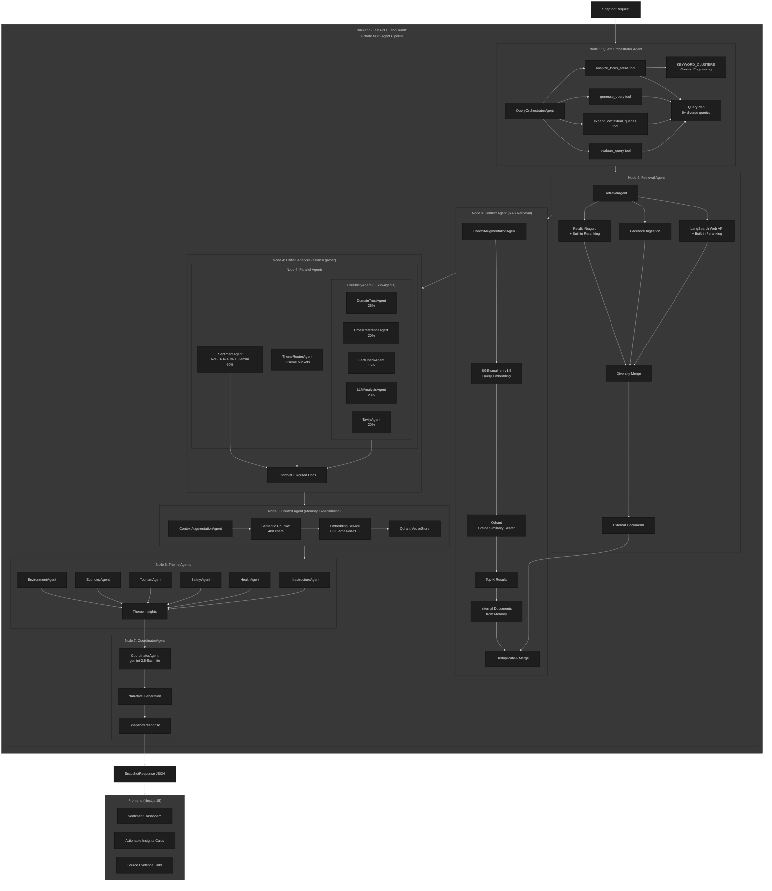
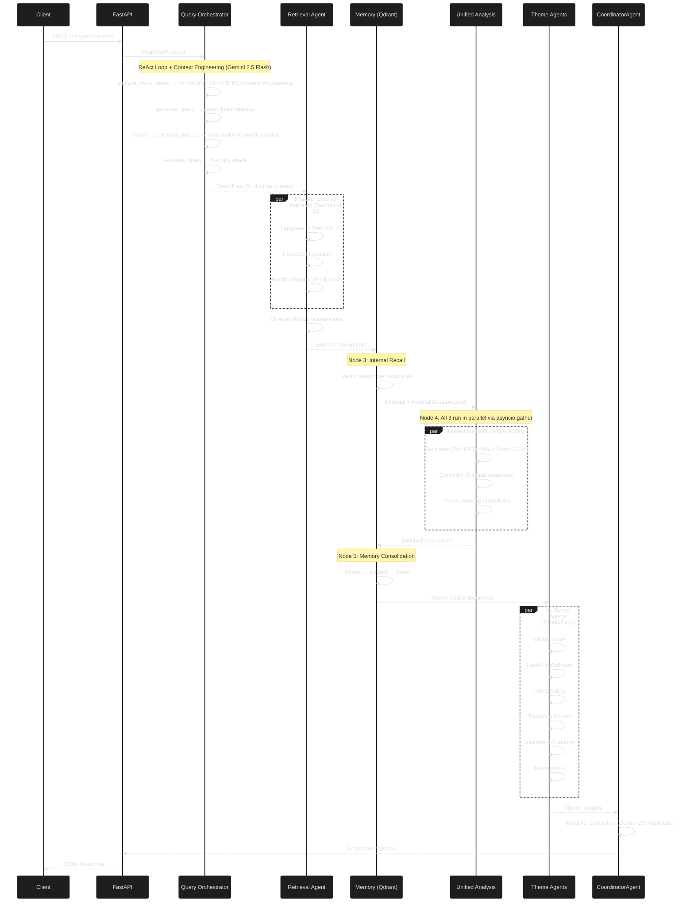
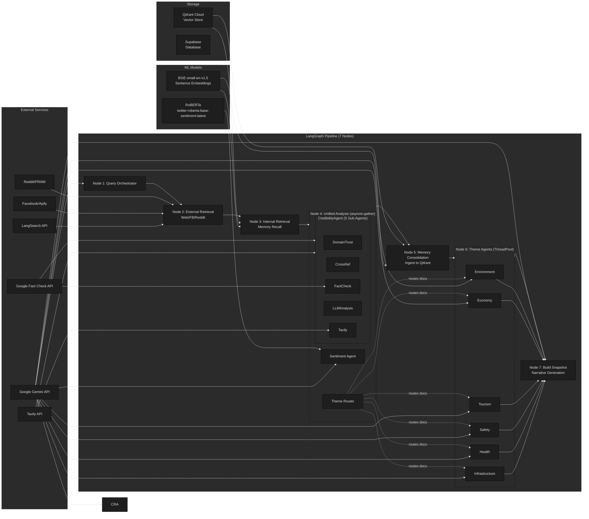
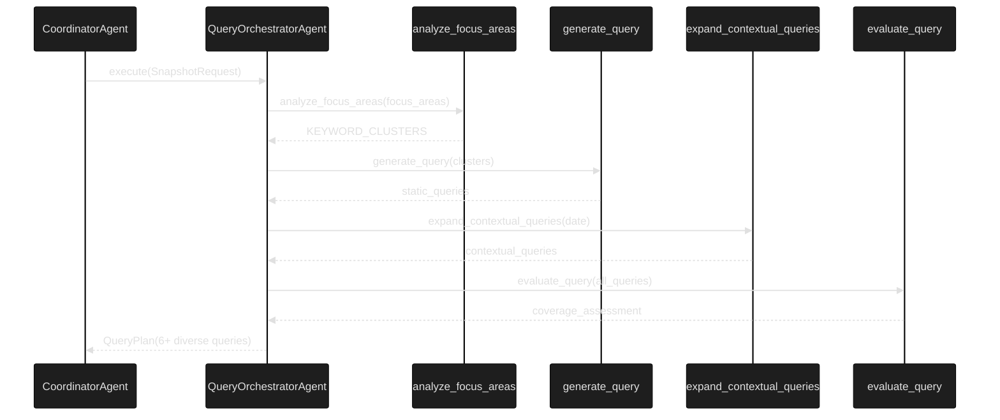
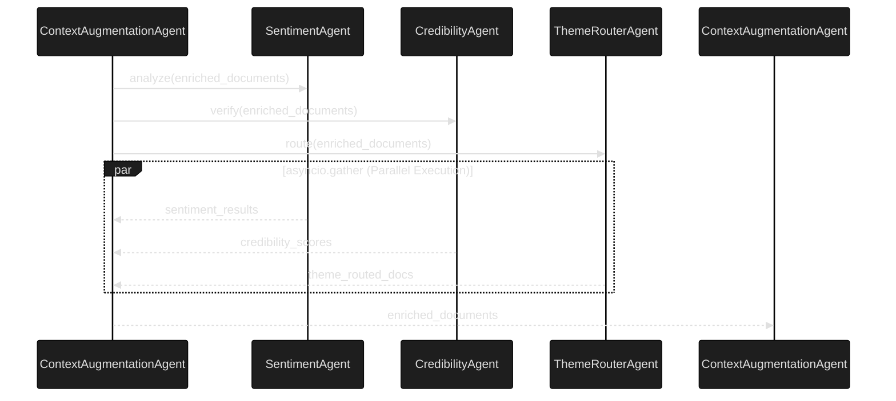
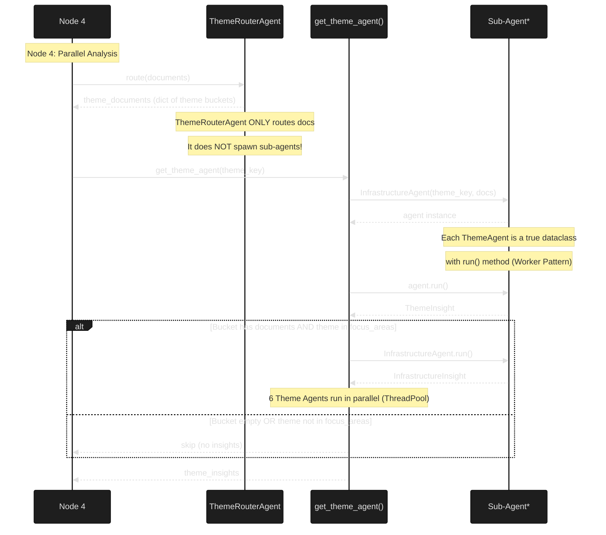
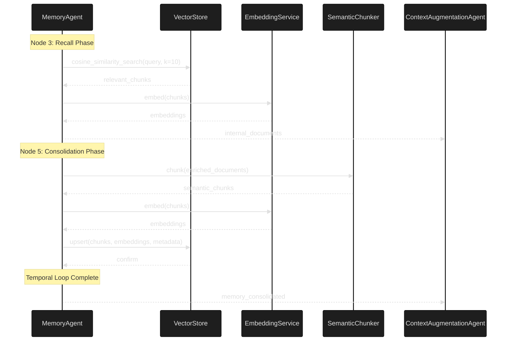

# Hinaing System Architecture

> **Thesis Title (Option 1):** 7-Node Agentic Graphs: Multi-Signal Fusion for Verified Context-Aware Public Opinion Synthesis
>
> **Thesis Title (Option 2):** Hinaing: A Neuro-Symbolic Multi-Agent Framework for Epistemic Truth Discovery in Civic Social Listening
>
> **Thesis Title (Option 3):** Hinaing: A Context-Engineered Self-Learning Multi-Agent Agentic AI System with Ensemble Sentiment and 5-Signal Credibility for Public Opinion Analysis in Baguio City
>
> **Thesis Title (Unified):** Hinaing: A 7-node Agentic Graphs Framework for Epistemic Truth Discovery in Civic Social Listening
>
> **Current Implementation:** Hinaing v2.0 (High-Performance 16GB RAM Optimized)
>
> **Future Implementation:** Hinaing v3.0 (Multi-Node Distributed System)

## Overview

Multi-Agentic AI system with real-time intelligent search and self learning RAG for context-aware public opinion analysis in Baguio City. It utilizes a **Neuro-Symbolic Graph-of-Thought** control flow and features a **7-Node Self-Learning Architecture** that combines external retrieval with internal memory recall and consolidation (Non-Parametric Systemic Learning).

> **Context Engineering**: The entire architecture is a form of context engineering. Rather than relying on a single LLM prompt, we design the pipeline structure, agent specializations (18 agents), keyword clusters (KEYWORD_CLUSTERS), theme definitions (THEME_GROUPS), credibility signals (5-signal framework), and domain trust tiers to inject Baguio-specific civic knowledge at every node.

## Agent Count Summary

| Category | Agents | Notes |
|----------|--------|-------|
| **Core Pipeline Agents** | 7 | QueryOrchestrator, Retrieval, Sentiment, Credibility, Context, ThemeRouter, Coordinator |
| **Theme Sub-Agents** | 6 | Infrastructure, Health, Safety, Tourism, Economy, Environment (conditionally spawned by Node 6 based on focus_areas) |
## Agent Count Summary (Federated Multi-Agent System)

| Category | Agents | Responsibility |
|----------|--------|----------------|
| **Core Executive Agents** | 7 | Orchestration, Retrieval, Ensemble Sentiment, 5-Signal Credibility, Context, Routing, Synthesis |
| **Theme Sub-Agents** | 6 | Infrastructure, Health, Safety, Tourism, Economy, Environment (Conditional Parallel Execution via get_theme_agent() factory - TRUE class-based sub-agents) |
| **Credibility Sub-Agents** | 5 | DomainTrust, CrossReference, FactCheck, LLMAnalysis, Tavily (Parallel Ensemble) |
| **Total Federated Agents** | **18** | Hierarchical Multi-Agent Graph |

> **Federated Autonomy**: Theme processing uses `get_theme_agent()` factory function to spawn **true class-based sub-agents** (InfrastructureAgent, HealthAgent, etc.) conditionally invoked by Node 6 based on: (1) theme bucket has documents (from ThemeRouterAgent routing) AND (2) theme matches requested focus_areas. Each theme agent is a dataclass with `run()` method implementing the **Worker Pattern**. This **Conditional Parallel Execution** ensures high-performance resource management (SLA-driven).

> **Neuro-Symbolic Optimization**: Sentiment, Credibility, and Theme Router agents run **concurrently** via `asyncio.gather`, while the Ensemble logic utilizes both statistical (RoBERTa) and neural (Gemini) weights.

## LLM Configuration

| Component | Model | Reason |
|-----------|-------|--------|
| **CoordinatorAgent** | `gemini-2.5-flash-lite` | Fast narrative generation (theme insights pre-summarized) |
| **QueryOrchestratorAgent** | `gemini-2.5-flash-lite` | Fast ReAct loop for query planning |
| **SentimentAgent (LLM)** | `gemini-2.5-flash-lite` | Context-aware classification, 60% ensemble weight |
| **CredibilityAgent** | `gemini-2.5-flash-lite` | Fast content quality scoring |
| **ThemeAgent (×6)** | `gemini-2.5-flash-lite` | Theme-specific insight generation |
| **ChatAgent** | `gemini-2.5-flash` | Fast Q&A responses |
| **RoBERTa** | `twitter-roberta-base-sentiment-latest` | Local model, 40% ensemble weight |
| **Embeddings** | `BAAI/bge-small-en-v1.5` | Local 384-dim vectors for RAG (upgraded from MiniLM) |

## 7-Node Self-Learning Pipeline (Control Flow)

The system implements what we term **"Self-Learning Cyclic RAG"** — a Read-Write Memory Loop where fresh external data is merged with internal memory, analyzed, and then consolidated back into the knowledge base (Temporal Memory Persistence).

**Graph Topology:** Directed Acyclic Graph (DAG) with Linear Topology.
**State Management:** Self-Learning Cyclic RAG (Read-Write Memory Loop).

> **Why DAG over Cyclic Graph?** A Cyclic Graph (autonomous looping) would introduce unbound latency (20+ minutes). The **Query Orchestrator Agent** mitigates the "brittleness" of a linear path by using **Context Engineering (Keyword Clusters)** to maximize success probability in a single pass, eliminating retry loops. This ensures predictable latency (Sub-30 seconds end-to-end) while enabling continuous systemic learning.


```
┌─────────────────────────────────────────────────────────────────────────────┐
│                    7-NODE MULTI-AGENT SELF-LEARNING PIPELINE                │
│              (18-AGENT FEDERATED MULTI-AGENT SYSTEM)                        │
├─────────────────────────────────────────────────────────────────────────────┤
│                                                                             │
│  ┌──────────────┐    ┌──────────────┐    ┌──────────────┐                  │
│  │   NODE 1     │    │   NODE 2     │    │   NODE 3     │                  │
│  │  Query Plan  │───▶│   Ingestion  │───▶│   Recall     │                  │
│  │ (Orchestrator)│    │   (Retrieval)│    │ (Context/RAG)│                  │
│  └──────────────┘    └──────────────┘    └──────────────┘                  │
│                                                 │                           │
│                                                 ▼                           │
│  ┌──────────────┐    ┌──────────────┐    ┌──────────────┐                  │
│  │   NODE 7     │    │   NODE 6     │    │   NODE 4     │                  │
│  │  Executive   │◀───│  Specialist  │◀───│  Enrichment  │                  │
│  │ (Synthesis)  │    │  (Experts)   │    │  (Analysis)  │                  │
│  └──────────────┘    └──────────────┘    └──────────────┘                  │
│                                                 │                           │
│                                                 ▼                           │
│                                          ┌──────────────┐                  │
│                                          │   NODE 5     │                  │
│                                          │ Consolidation│◀── LEARNING      │
│                                          │ (Consolidate)│     LOOP         │
│                                          └──────────────┘                  │
│                                                                             │
│  FEDERATED: 7 Core + 6 Theme + 5 Credibility = 18 Total Agents              │
└─────────────────────────────────────────────────────────────────────────────┘
```

### Node Descriptions (Agent & Node Mapping)

| Node | Agent(s) | Function | Key Components |
|------|----------|----------|----------------|
| 1 | **QueryOrchestratorAgent** | ReAct Reasoning & Autonomous Query Planning | Linearized Knowledge Graph (KEYWORD_CLUSTERS), 4 Specialized Tools, Gemini 2.5 Flash-Lite |
| 2 | **RetrievalAgent** | Autonomous Multi-Platform Data Ingestion | LangSearch (Web), PRAW (Reddit), Apify (Facebook), Round-Robin Interleaving |
| 3 | **ContextAugmentationAgent** | Epistemic Recall: Semantic Memory Retrieval | Qdrant Persistent Store, BGE-small-en-v1.5 Embeddings, Top-K Cosine Similarity |
| 4 | **Ensemble Sentiment Agent** + **5-Signal Credibility Verifier** + **ThemeRouterAgent** | High-Throughput Parallel Data Enrichment & Verification | Neuro-Symbolic Model Fusion (RoBERTa + Gemini), Multi-Signal Logic, Contextual Routing |
| 5 | **ContextAugmentationAgent** | Temporal Memory Consolidation (Self-Learning Loop) | Recursive Agentic Indexing, SemanticChunker, Metadata-Enriched Vectors |
| 6 | **Domain Theme Agents** (×6 Parallel Experts) | Domain-Specific Autonomous Reasoning & Insight Synthesis | True Class-Based Sub-Agents with `run()` methods, `get_theme_agent()` factory for conditional spawning |
| 7 | **Narrative Synthesis Executive** | Executive Assembly & Strategic Narrative Generation | Context-Aware Synthesis, Gemini 2.5 Flash-Lite, Global State Assembly |

## System Architecture: Hierarchical DAG-Based Multi-Agent Agentic Workflow

> **Note:** This is a **detailed implementation diagram** showing internal agent components, tools, and APIs. For a high-level conceptual diagram showing the overall/summarized pipeline flow and temporal memory loop, see `ARCHITECTURE_SUMMARY.md`.



### Updated Node 2: Retrieval Agent with Source-Level Reranking

The Retrieval Agent performs platform-specific retrieval with built-in reranking for efficiency:

1. **LangSearch Web API**: Retrieves and automatically reranks web documents by semantic relevance
2. **Facebook Ingestion**: Retrieves Facebook documents (no built-in reranking)
3. **Reddit Ingestion**: Retrieves and automatically reranks Reddit documents by semantic relevance
4. **Diversity Merge**: Combines results from all sources using round-robin interleaving
5. **External Documents**: Merged results passed to downstream analysis agents

This approach minimizes latency by performing reranking at the source level rather than as a separate post-merge step. When both "web" and "facebook" platforms are selected, an additional reranking step is applied to the combined results for enhanced relevance.


## Detailed Agent Flow (Sequence Diagram)



## Component Architecture



## AUML Design Documentation (AOSE Methodology)

> **Methodology:** Agent-Oriented Software Engineering (AOSE) with **Worker Pattern** implementation
> 
> This section presents **AUML (Agent UML)** diagrams demonstrating AOSE design principles applied in the Hinaing system. AUML extends UML to model agent-based systems, showing agent roles, responsibilities, and interaction protocols. The implementation uses the **Worker Pattern** (dataclass agents with `run()` methods)—a modern, pragmatic approach that maintains all AOSE semantics while optimizing for production performance.

### AUML Class Diagram (AOSE Design Model)

The diagrams below document **AOSE principles** using AUML notation—showing agent roles, responsibilities, and relationships. The implementation uses dataclass workers to realize these concepts.

```mermaid
%%{init: {'theme': 'base', 'themeVariables': {
  'primaryColor': '#1e1e1e',
  'primaryTextColor': '#e0e0e0',
  'secondaryColor': '#2d2d2d',
  'tertiaryColor': '#383838',
  'primaryFontSize': '14px',
  'secondaryFontSize': '12px',
  'classLabelBoxBackgroundColor': '#1e1e1e',
  'classLabelBoxBorderColor': '#e0e0e0',
  'classLabelFontSize': '14px'
 }}}%%
classDiagram
    %% AOSE Design: Worker Pattern Realization
    
    %% Agent Workers (Dataclass implementation of AOSE concepts)
    class QueryOrchestratorAgent {
        <<dataclass>>
        +llm: ChatGoogleGenerativeAI
        +tools: List[Tool]
        +KEYWORD_CLUSTERS
        +run(request: SnapshotRequest) QueryPlan
        "Autonomous query planning"
    }

    class RetrievalAgent {
        <<dataclass>>
        +sources: List[DataSource]
        +run(request, query_plan) List~WebDocument~
        "Multi-source ingestion"
    }

    class SentimentAgent {
        <<dataclass>>
        +roberta_model: RoBERTa
        +gemini_model: GenerativeModel
        +run(documents) List~WebDocument~
        "Ensemble sentiment analysis"
    }

    class CredibilityAgent {
        <<dataclass>>
        +tavily_api_key: String
        +fact_check_api_key: String
        +run(documents) List~WebDocument~
        "Multi-signal verification"
    }

    class ThemeRouterAgent {
        <<dataclass>>
        +theme_groups: Dict
        +run(documents, request) Dict~str, List~WebDocument~
        "Content classification"
    }

    class ContextAugmentationAgent {
        <<dataclass>>
        +vector_store: VectorStore
        +chunker: SemanticChunker
        +retrieve_knowledge() List~WebDocument~
        +consolidate_memory() int
        "Memory recall + consolidation"
    }

    class CoordinatorAgent {
        <<dataclass>>
        +client: GeminiClient
        +is_available: bool
        +run(window, focus_areas, documents, theme_insights) Tuple
        "Narrative synthesis"
    }

    CredibilityAgent "coordinates" o--> "5" CredibilitySubAgent
    CredibilitySubAgent <|-- DomainTrustAgent
    CredibilitySubAgent <|-- CrossReferenceAgent
    CredibilitySubAgent <|-- FactCheckAgent
    CredibilitySubAgent <|-- LLMAnalysisAgent
    CredibilitySubAgent <|-- TavilyAgent
    
    %% Theme Sub-Agents (6 Domain Experts) - Spawned by get_theme_agent() factory in Node 6
    %% ThemeRouterAgent only ROUTES to these, does NOT spawn them
    class ThemeAgent {
        <<interface>>
        +theme_label: String
        +run(documents) List~Insight~
    }
    
    class InfrastructureAgent {
        <<dataclass>>
        +theme_label: String = "infrastructure"
        +run(documents) List~Insight~
    }
    
    class HealthAgent {
        <<dataclass>>
        +theme_label: String = "health"
        +run(documents) List~Insight~
    }
    
    class SafetyAgent {
        <<dataclass>>
        +theme_label: String = "safety"
        +run(documents) List~Insight~
    }
    
    class TourismAgent {
        <<dataclass>>
        +theme_label: String = "tourism"
        +run(documents) List~Insight~
    }
    
    class EconomyAgent {
        <<dataclass>>
        +theme_label: String = "economy"
        +run(documents) List~Insight~
    }
    
    class EnvironmentAgent {
        <<dataclass>>
        +theme_label: String = "environment"
        +run(documents) List~Insight~
    }
    
    %% Node 6 spawns Theme Agents via factory (NOT ThemeRouterAgent)
    Node6 "spawns via" o--> "6" ThemeAgent
    ThemeAgent <|-- InfrastructureAgent
    ThemeAgent <|-- HealthAgent
    ThemeAgent <|-- SafetyAgent
    ThemeAgent <|-- TourismAgent
    ThemeAgent <|-- EconomyAgent
    ThemeAgent <|-- EnvironmentAgent
    
    %% Composition (AOSE relationships)
    QueryOrchestratorAgent "uses" o--> ChatGoogleGenerativeAI
    QueryOrchestratorAgent "uses" o--> "4" Tool
    RetrievalAgent "uses" o--> "3" DataSource
    SentimentAgent "uses" o--> RoBERTa
    SentimentAgent "uses" o--> GenerativeModel
    CredibilityAgent "uses" o--> TavilyAPI
    CredibilityAgent "uses" o--> GoogleFactCheckAPI
    ThemeRouterAgent "uses" o--> EmbeddingService
    ContextAugmentationAgent "uses" o--> VectorStore
    ContextAugmentationAgent "uses" o--> EmbeddingService
    CoordinatorAgent "uses" o--> GeminiClient
```



> **AOSE Validation:** This diagram demonstrates **Agent-Oriented Software Engineering** principles: each worker is an **autonomous agent** with distinct **roles**, **responsibilities**, and **capabilities**. The `<<dataclass>>` notation indicates the implementation pattern, while the relationships and responsibilities document the **AOSE design model**.

### Worker Node Mapping (AOSE Execution Model)

Each **graph node** is an **autonomous agent** that executes tasks based on input state:

| Node | Agent | AOSE Pattern | Execution |
|------|-------|--------------|-----------|
| **Node 1** | QueryOrchestratorAgent | Goal Delegation | Autonomous ReAct planning |
| **Node 2** | RetrievalAgent | Resource Aggregation | Multi-source ingestion |
| **Node 3** | ContextAugmentationAgent | Knowledge Management | Memory recall |
| **Node 4** | [3 parallel agents] | Model Composition | asyncio.gather |
| **Node 5** | ContextAugmentationAgent | Knowledge Management | Memory consolidation |
| **Node 6** | get_theme_agent() (factory) | Expert Pattern | Class-based Theme Agents with run() |
| **Node 7** | CoordinatorAgent | Result Integration | Narrative synthesis |

### Defense Statement: AOSE Compliance

> "This system is **fully compliant with Agent-Oriented Software Engineering (AOSE)** principles:
> 1. **Autonomous Agents**: Each worker (`QueryOrchestratorAgent`, `RetrievalAgent`, etc.) is an autonomous entity that processes input and produces output independently
> 2. **Role-Based Design**: Distinct agents with specialized responsibilities (planning, retrieval, analysis, synthesis)
> 3. **Goal Delegation**: Higher-level agents delegate tasks to specialized agents (Node 4 delegates to Sentiment, Credibility, ThemeRouter)
> 4. **Inter-Agent Communication**: Sequential nodes pass state; parallel agents coordinate via `asyncio.gather`
> 5. **Self-Learning Memory**: Dual-phase RAG (recall + consolidation) demonstrates non-parametric learning
>
> The **Worker Pattern** (dataclass agents) is a **pragmatic AOSE implementation**—maintaining all AOSE semantics while optimizing for production performance. AUML diagrams document the **design model**; dataclass workers realize the **implementation model**. Both are valid AOSE."

### Agent Interaction Protocols (AUML Sequence Diagrams)

#### Protocol 1: Query Planning Protocol (Request-Response)



#### Protocol 2: Parallel Analysis Protocol (Fan-Out/Fan-In)



#### Protocol 3: Conditional Theme Agent Spawning (Dynamic Creation)



#### Protocol 4: Self-Learning Memory Protocol (Cyclic RAG)



### Agent Responsibility Model (Actual Implementation)

| Agent (Worker) | Responsibility | Input | Output | Pattern |
|---------------|----------------|-------|--------|---------|
| **QueryOrchestratorAgent** | Autonomous query planning with ReAct reasoning | SnapshotRequest | QueryPlan | Sequential |
| **RetrievalAgent** | Multi-source data ingestion and diversity merging | SnapshotRequest + QueryPlan | List~WebDocument~ | Sequential |
| **ContextAugmentationAgent** | Dual operations: memory recall and consolidation | List~WebDocument~ | Recall: List~WebDocument~; Consolidate: int | Sequential |
| **SentimentAgent** | Ensemble sentiment quantification (RoBERTa + Gemini) | List~WebDocument~ | List~WebDocument~ | Parallel (Node 4) |
| **CredibilityAgent** | Multi-signal verification (5 signals) and misinformation detection | List~WebDocument~ | List~WebDocument~ | Parallel (Node 4) |
| **ThemeRouterAgent** | Semantic content classification using BGE embeddings (routes docs to 6 theme buckets) | List~WebDocument~ | Dict[str, List~WebDocument~] | Parallel (Node 4) |
| **CoordinatorAgent** | Narrative synthesis and response generation | Dict | SnapshotResponse | Sequential |
| **InfrastructureAgent** | Generate infrastructure insights via Gemini (conditionally spawned by Node 6 if docs exist AND theme in focus_areas) | List~WebDocument~ | List~Insight~ | Parallel (ThreadPool) |
| **HealthAgent** | Generate health insights via Gemini (conditionally spawned by Node 6 if docs exist AND theme in focus_areas) | List~WebDocument~ | List~Insight~ | Parallel (ThreadPool) |
| **SafetyAgent** | Generate safety insights via Gemini (conditionally spawned by Node 6 if docs exist AND theme in focus_areas) | List~WebDocument~ | List~Insight~ | Parallel (ThreadPool) |
| **TourismAgent** | Generate tourism insights via Gemini (conditionally spawned by Node 6 if docs exist AND theme in focus_areas) | List~WebDocument~ | List~Insight~ | Parallel (ThreadPool) |
| **EconomyAgent** | Generate economy insights via Gemini (conditionally spawned by Node 6 if docs exist AND theme in focus_areas) | List~WebDocument~ | List~Insight~ | Parallel (ThreadPool) |
| **EnvironmentAgent** | Generate environment insights via Gemini (conditionally spawned by Node 6 if docs exist AND theme in focus_areas) | List~WebDocument~ | List~Insight~ | Parallel (ThreadPool) |

### Design Patterns Applied (Actual)

| Pattern | Application | Benefit |
|---------|-------------|---------|
| **Worker Pattern** | Dataclass agents with `run()` methods | Lightweight, no inheritance overhead |
| **Singleton Workers** | Module-level agent instances | Reusable across nodes |
| **Delegation** | Nodes delegate to workers | Separation of concerns |
| **Hierarchical Organization** | Coordinator → Nodes → Workers | Delegation structure |
| **Conditional Execution** | Theme Agents only called when documents exist | Resource efficiency |
| **Parallel Protocol Execution** | asyncio.gather for Node 4, ThreadPool for Node 6 | Performance optimization |
| **Self-Learning Memory Loop** | Read-Write RAG (Nodes 3 & 5) | Non-parametric learning |
| **Direct Function Calls** | Nodes call worker.run() directly | Minimal overhead |
| **Ensemble Composition** | RoBERTa + Gemini for sentiment | Model diversity |
| **Multi-Signal Verification** | 5 credibility signals | Robust trust assessment |

> **Implementation Note:** The diagrams above document the **actual implementation**—pragmatic functional composition via dataclass workers. This differs from traditional AOSE inheritance hierarchies but maintains the same semantic behavior: autonomous agents with distinct responsibilities executing tasks based on input states.

---

## Theme Groups

| Theme | Label | Keywords | Focus Values |
|-------|-------|----------|--------------|
| infrastructure | Infrastructure | road, traffic, water, power, bridge, construction, kennon, session road | infrastructure |
| health | Health & Wellness | hospital, clinic, dengue, covid, vaccine, medicine, bgh | health |
| safety | Public Safety | crime, police, fire, landslide, accident, emergency, flood, walkout, protest | safety |
| tourism | Tourism & Events | tourist, hotel, festival, panagbenga, visitor, burnham, overcrowding | tourism |
| economy | Business & Economy | market, vendor, livelihood, mallification, SM Prime, price, displacement | economy, business |
| environment | Environment | garbage, pollution, waste, tree, climate, air quality, flooding | environment |

## The 5-Signal Credibility Framework

The `CredibilityAgent` employs a **Multi-Signal Verification Strategy** with weighted ensemble:

| Signal | Weight | Description |
|--------|--------|-------------|
| **Domain Trust** | 25% | Tiered scoring (gov.ph = 0.95, social media = 0.45) |
| **Semantic Cross-Reference** | 20% | BGE embeddings for cosine similarity between documents |
| **Google Fact Check API** | 15% | Real-time query against Google's fact-check repository |
| **LLM Pattern Recognition** | 20% | Gemini analyzes for clickbait, conspiracy framing, misinformation |
| **Tavily Web Verification** | 20% | Real-time web search to verify claims against authoritative sources |

### Domain Trust Tiers

| Tier | Score | Examples |
|------|-------|----------|
| Government | 0.90-0.95 | gov.ph, pia.gov.ph, pna.gov.ph |
| Fact-checkers | 0.85-0.90 | verafiles.org, rappler.com |
| Established News | 0.75-0.82 | inquirer.net, philstar.com, gmanetwork.com |
| Organizations | 0.65-0.70 | .org.ph, .org |
| Social Media | 0.40-0.50 | facebook.com, reddit.com, twitter.com |
| User-generated | 0.35-0.45 | medium.com, wordpress.com |

## Time-Based Search Filtering

Multi-layer approach to prioritize fresh content:

### 1. Query-Level Time Operators
Search queries include Google-style `after:YYYY-MM-DD` operators:

| Time Window | Search Suffix | Example |
|-------------|---------------|---------|
| 6h | `after:{today}` | `after:2025-12-12` |
| 24h | `after:{yesterday}` | `after:2025-12-11` |
| 3d | `after:{3 days ago}` | `after:2025-12-09` |
| 7d | `after:{7 days ago}` | `after:2025-12-05` |

### 2. API-Level Freshness Hints
LangSearch API receives a `freshness` parameter:
- `6h` / `24h` → `oneDay`
- `3d` / `7d` → `oneWeek`

### 3. Client-Side Time Filtering
Documents filtered by `published_at` timestamp after retrieval.

## Multi-Query Diversity Strategy (Context Engineering)

The QueryOrchestratorAgent uses **context engineering** via KEYWORD_CLUSTERS and contextual expansion to generate diverse, Baguio-specific queries:

### KEYWORD_CLUSTERS (Static Context Engineering)

Pre-defined domain knowledge organized by civic theme:

```python
KEYWORD_CLUSTERS = {
    "infrastructure": [
        ["Baguio traffic congestion", "Session Road rehabilitation", "Baguio public transport"],
        ["Baguio road repair", "Kennon Road closure", "Baguio construction delay"],
        ["Baguio water shortage", "Baguio drainage issue", "Baguio power outage"],
        ...
    ],
    "health": [...],
    "safety": [...],
    ...
}
```

### Contextual Expansion (Dynamic Context Engineering)

The `expand_contextual_queries` tool generates time-aware queries based on current date:
- **December**: Christmas traffic, New Year safety, holiday tourism
- **February**: Panagbenga festival, flower festival crowds
- **June-October**: Typhoon updates, landslide warnings, flooding
- **Summer**: Water shortage, tourist overcrowding

### ReAct Tool Workflow

| Tool | Purpose | Output |
|------|---------|--------|
| `analyze_focus_areas` | Retrieves KEYWORD_CLUSTERS for selected focus areas | Keyword clusters organized by topic |
| `generate_query` | Builds diverse queries from clusters (1 per cluster) | Static cluster queries |
| `expand_contextual_queries` | Adds seasonal/time-aware queries | Contextual queries |
| `evaluate_query` | Validates topic diversity coverage | Coverage assessment |

**Strategy**: One query per cluster ensures topic diversity. Results are merged using round-robin interleaving to prevent any single topic from dominating.

## RAG Memory System (Qdrant Cloud)

The system uses **Qdrant Cloud** for persistent vector storage with intelligent filtering:

### Metadata-Based Filtering
Each document chunk is stored with:
- `focus_area`: Parent category (safety, health, infrastructure, etc.)
- `topic`: Granular topic (crime incident, landslide warning, etc.)

### Retrieval Strategy (3-Tier)
1. **Tier 1 - Filtered Vector Search**: Cosine similarity within documents matching `focus_area` filter
2. **Tier 2 - Unfiltered Vector Search**: If Tier 1 returns <3 results, cosine similarity across all documents
3. **Tier 3 - Keyword Reranking**: Post-processing re-rank by keyword presence (60% semantic + 30% keyword + 10% metadata)

### Payload Indexes
```python
# Auto-created on startup
index_fields = ["focus_area", "topic"]  # keyword type for exact matching
```

### Embedding Model
- **Model**: `BAAI/bge-small-en-v1.5` (upgraded from MiniLM for better accuracy)
- **Dimensions**: 384
- **Min Score Threshold**: 0.50 (higher precision)

## Data Flow Summary (18 Agents)

```
SnapshotRequest
    → Node 1: QueryOrchestratorAgent (ReAct + KEYWORD_CLUSTERS + Contextual Expansion)
    → Node 2: RetrievalAgent (LangSearch + Facebook + Reddit, parallel batching)
    → Node 3: ContextAugmentationAgent.retrieve_knowledge() (Qdrant filtered + semantic fallback)
    → Node 4: PARALLEL [SentimentAgent + CredibilityAgent (5 sub-agents) + ThemeRouterAgent]
    │           └── CredibilityAgent runs: DomainTrust + CrossReference + FactCheck + LLMAnalysis + Tavily
    → Node 5: ContextAugmentationAgent.consolidate_memory() (Chunk → Embed → Store with focus_area/topic)
    → Node 6: ThemeAgent ×6 in PARALLEL (Infrastructure, Health, Safety, Tourism, Economy, Environment)
    → Node 7: CoordinatorAgent.run() (Narrative Generation with Gemini 2.5 Flash Lite)
    → SnapshotResponse

FEDERATED ARCHITECTURE: 7 Core + 11 Sub-Agents = 18 Total Autonomous Agents
```

## Tech Stack

| Layer | Technology |
|-------|------------|
| Frontend | Next.js 15, React 19, TypeScript, Tailwind CSS |
| Backend | FastAPI, Python 3.11+, Poetry |
| Orchestration | LangChain, LangGraph |
| LLM | Google Gemini (2.5-flash-lite for all agents) |
| Sentiment | RoBERTa (twitter-roberta-base-sentiment-latest) |
| Embeddings | BGE-small-en-v1.5 (384 dimensions) |
| Vector DB | Qdrant Cloud (with focus_area/topic payload indexes) |
| Search | LangSearch API |
| Social | Reddit (PRAW), Facebook (Apify) |
| Fact-Check | Google Fact Check API, Tavily |
| Database | Supabase |
| Observability | LangSmith |

## Hybrid Architectures (Control vs Novel)

### A. The Chat Agent (Control Group)
- **Pattern:** Agentic RAG (ReAct Loop)
- **Goal:** Single-turn, atomic question answering
- **Stack:** Gemini 2.0 Flash + LangSearch
- **Behavior:** Reactive, waiting for user input

### B. The Sentiment Generator (Novel Contribution)
- **Pattern:** Hierarchical Graph-Based Multi-Agent System with Self-Learning
- **Goal:** Holistic, proactive landscape analysis with memory
- **Stack:** LangGraph + 7-Node Pipeline + Ensemble Sentiment + 5-Signal Credibility
- **Behavior:** Proactive, scans environment, learns from each run

## Key Implementation Files

| Component | File |
|-----------|------|
| LangGraph Pipeline | `backend/app/services/insights/graph.py` |
| Agent Orchestrators | `backend/app/services/insights/agents.py` |
| Agent Tools | `backend/app/services/insights/agent_tools.py` |
| Query Orchestrator | `backend/app/services/agents/query_orchestrator.py` |
| Sentiment Agent | `backend/app/services/agents/sentiment_agent.py` |
| Credibility Agent | `backend/app/services/agents/credibility_agent.py` |
| Context Agent | `backend/app/services/agents/context_agent.py` |
| Theme Agent | `backend/app/services/agents/theme_agent.py` |
| Coordinator Agent | `backend/app/services/agents/coordinator_agent.py` |
| RAG Chunker | `backend/app/services/rag/chunker.py` |
| RAG Embeddings | `backend/app/services/rag/embeddings.py` |
| RAG Vector Store | `backend/app/services/rag/vector_store.py` |
| LangSearch Client | `backend/app/services/langsearch.py` |
| Reddit Ingestion | `backend/app/services/ingestion/reddit.py` |
| Facebook Ingestion | `backend/app/services/ingestion/facebook.py` |
