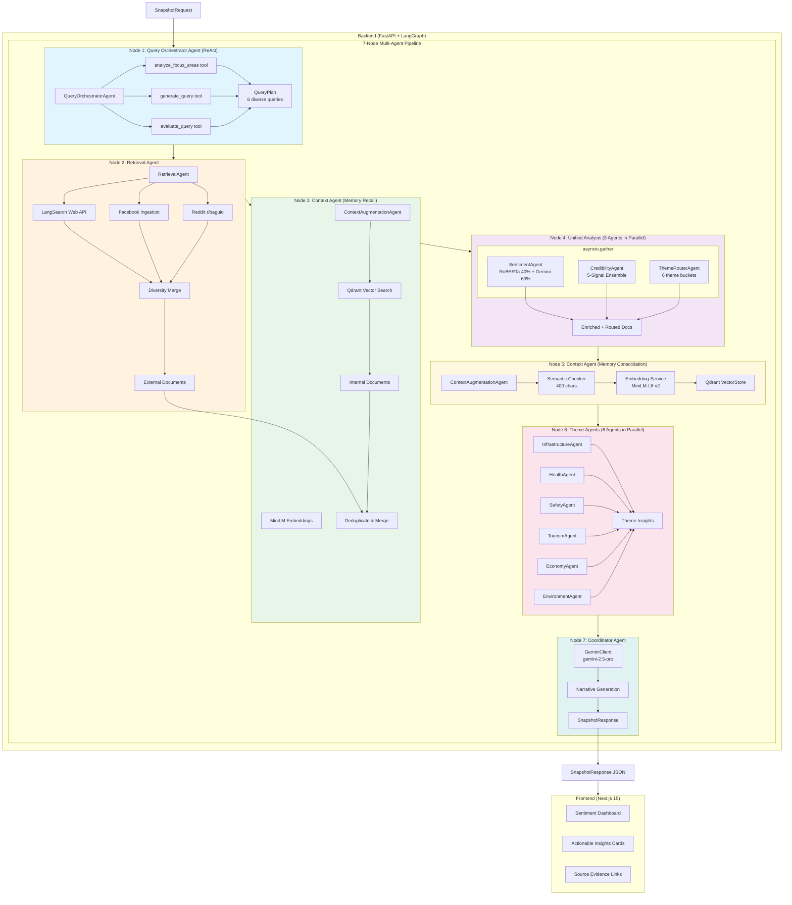
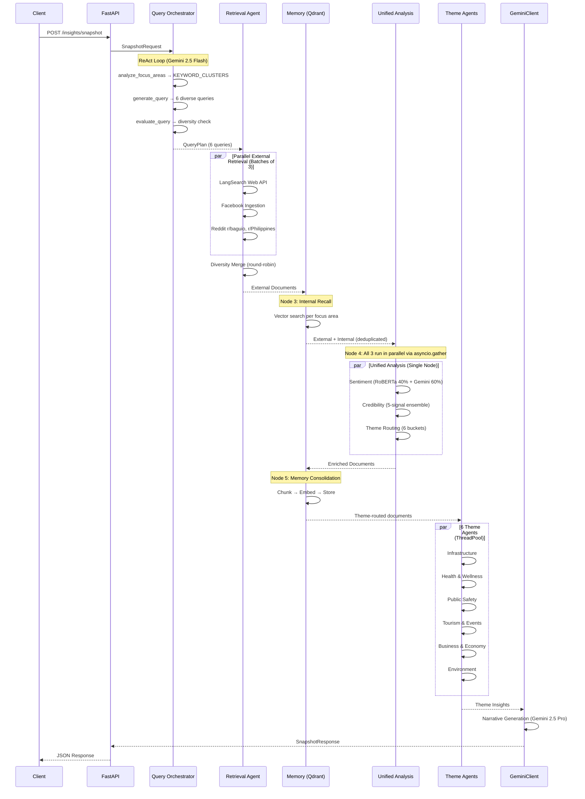
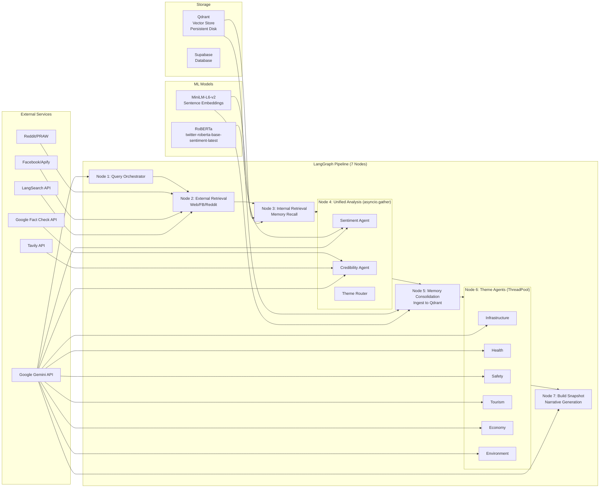

# Hinaing System Architecture

## Overview

Multi-Agentic AI system with real-time intelligent search and RAG for context-aware public opinion analysis in Baguio City. Features a **7-Node Self-Learning Architecture** that combines external retrieval with internal memory recall and consolidation.

## Agent Count Summary

| Category | Agents | Notes |
|----------|--------|-------|
| **Core Pipeline Agents** | 6 | Query Orchestrator, Retrieval, Sentiment, Credibility, Context, Theme Router |
| **Theme Sub-Agents** | 6 | Infrastructure, Health, Safety, Tourism, Economy, Environment |
| **Total** | **12** | 6 main + 6 theme-specific |

> **Optimization Note**: Sentiment, Credibility, and Theme Router agents now run **in parallel** via `asyncio.gather` in a single unified analysis node, reducing latency significantly.

## LLM Configuration

| Component | Model | Reason |
|-----------|-------|--------|
| **Narrative Summary** | `gemini-2.5-pro` | Comprehensive topic coverage |
| **Query Orchestrator** | `gemini-2.5-flash` | Fast ReAct loop for query planning |
| **Sentiment Agent (LLM)** | `gemini-2.5-pro` | Context-aware classification, 60% ensemble weight |
| **Credibility Agent** | `gemini-2.5-flash` | Fast content quality scoring |
| **Theme Agents (6x)** | `gemini-2.5-flash` | Fast insight generation |
| **Chat Agent** | `gemini-2.0-flash-exp` | Fast Q&A responses |
| **RoBERTa** | `twitter-roberta-base-sentiment-latest` | Local model, 40% ensemble weight |
| **Embeddings** | `sentence-transformers/all-MiniLM-L6-v2` | Local 384-dim vectors for RAG |

## 7-Node Self-Learning Pipeline

The system implements a cyclic learning architecture where fresh external data is merged with internal memory, analyzed, and then consolidated back into the knowledge base.

```
┌─────────────────────────────────────────────────────────────────────────────┐
│                    7-NODE MULTI-AGENT SELF-LEARNING PIPELINE                │
├─────────────────────────────────────────────────────────────────────────────┤
│                                                                             │
│  ┌──────────────┐    ┌──────────────┐    ┌──────────────┐                  │
│  │   NODE 1     │    │   NODE 2     │    │   NODE 3     │                  │
│  │   Query      │───▶│  Retrieval   │───▶│   Context    │                  │
│  │ Orchestrator │    │    Agent     │    │    Agent     │                  │
│  │    Agent     │    │ (Web/FB/RD)  │    │  (Recall)    │                  │
│  └──────────────┘    └──────────────┘    └──────────────┘                  │
│                                                 │                           │
│                                                 ▼                           │
│  ┌──────────────┐    ┌──────────────┐    ┌──────────────┐                  │
│  │   NODE 7     │    │   NODE 6     │    │   NODE 4     │                  │
│  │ Coordinator  │◀───│  6 Theme     │◀───│  3 Agents    │                  │
│  │    Agent     │    │   Agents     │    │  (Parallel)  │                  │
│  │ (Narrative)  │    │  (Parallel)  │    │ Sent+Cred+TR │                  │
│  └──────────────┘    └──────────────┘    └──────────────┘                  │
│                                                 │                           │
│                                                 ▼                           │
│                                          ┌──────────────┐                  │
│                                          │   NODE 5     │                  │
│                                          │   Context    │◀─── LEARNING     │
│                                          │    Agent     │     LOOP         │
│                                          │ (Consolidate)│                  │
│                                          └──────────────┘                  │
│                                                                             │
│  TOTAL: 12 AGENTS (6 Core + 6 Theme)                                       │
└─────────────────────────────────────────────────────────────────────────────┘
```

### Node Descriptions (Agent Mapping)

| Node | Agent(s) | Function | Key Components |
|------|----------|----------|----------------|
| 1 | **QueryOrchestratorAgent** | ReAct reasoning to generate diverse search queries | KEYWORD_CLUSTERS, 3 tools, Gemini 2.5 Flash |
| 2 | **RetrievalAgent** | Fetch fresh documents from web, Facebook, Reddit | LangSearch, PRAW, Apify, parallel batching |
| 3 | **ContextAugmentationAgent** | Retrieve relevant memories from vector store | Qdrant, MiniLM embeddings, `retrieve_knowledge()` |
| 4 | **SentimentAgent** + **CredibilityAgent** + **ThemeRouterAgent** | Parallel sentiment + credibility + theme routing | asyncio.gather, RoBERTa+Gemini ensemble, 5-signal credibility |
| 5 | **ContextAugmentationAgent** | Ingest enriched documents into knowledge base | SemanticChunker, VectorStore, `consolidate_memory()` |
| 6 | **6 Theme Agents** (Infrastructure, Health, Safety, Tourism, Economy, Environment) | Generate insights per theme category | 6x parallel Gemini calls, ThreadPoolExecutor |
| 7 | **Coordinator** (GeminiClient) | Assemble final response with narrative | Gemini 2.5 Pro narrative generation |

## System Flow Diagram




## Detailed Agent Flow (Sequence Diagram)



## Component Architecture



## Theme Groups

| Theme | Label | Keywords | Focus Values |
|-------|-------|----------|--------------|
| infrastructure | Infrastructure | road, traffic, water, power, bridge, construction, kennon, session road | infrastructure |
| health | Health & Wellness | hospital, clinic, dengue, covid, vaccine, medicine, bgh | health |
| safety | Public Safety | crime, police, fire, landslide, accident, emergency, flood, walkout, protest | safety |
| tourism | Tourism & Events | tourist, hotel, festival, panagbenga, visitor, burnham, overcrowding | tourism |
| economy | Business & Economy | market, vendor, livelihood, mallification, SM Prime, price, displacement | economy, business |
| environment | Environment | garbage, pollution, waste, tree, climate, air quality, flooding | environment |

## The 5-Signal Credibility Framework

The `CredibilityAgent` employs a **Multi-Signal Verification Strategy** with weighted ensemble:

| Signal | Weight | Description |
|--------|--------|-------------|
| **Domain Trust** | 25% | Tiered scoring (gov.ph = 0.95, social media = 0.45) |
| **Semantic Cross-Reference** | 20% | MiniLM embeddings for cosine similarity between documents |
| **Google Fact Check API** | 15% | Real-time query against Google's fact-check repository |
| **LLM Pattern Recognition** | 20% | Gemini analyzes for clickbait, conspiracy framing, misinformation |
| **Tavily Web Verification** | 20% | Real-time web search to verify claims against authoritative sources |

### Domain Trust Tiers

| Tier | Score | Examples |
|------|-------|----------|
| Government | 0.90-0.95 | gov.ph, pia.gov.ph, pna.gov.ph |
| Fact-checkers | 0.85-0.90 | verafiles.org, rappler.com |
| Established News | 0.75-0.82 | inquirer.net, philstar.com, gmanetwork.com |
| Organizations | 0.65-0.70 | .org.ph, .org |
| Social Media | 0.40-0.50 | facebook.com, reddit.com, twitter.com |
| User-generated | 0.35-0.45 | medium.com, wordpress.com |

## Time-Based Search Filtering

Multi-layer approach to prioritize fresh content:

### 1. Query-Level Time Operators
Search queries include Google-style `after:YYYY-MM-DD` operators:

| Time Window | Search Suffix | Example |
|-------------|---------------|---------|
| 6h | `after:{today}` | `after:2025-12-12` |
| 24h | `after:{yesterday}` | `after:2025-12-11` |
| 3d | `after:{3 days ago}` | `after:2025-12-09` |
| 7d | `after:{7 days ago}` | `after:2025-12-05` |

### 2. API-Level Freshness Hints
LangSearch API receives a `freshness` parameter:
- `6h` / `24h` → `oneDay`
- `3d` / `7d` → `oneWeek`

### 3. Client-Side Time Filtering
Documents filtered by `published_at` timestamp after retrieval.

## Multi-Query Diversity Strategy

The Query Orchestrator generates **6 diverse queries** using KEYWORD_CLUSTERS:

```python
KEYWORD_CLUSTERS = {
    "infrastructure": [
        ["Baguio traffic congestion", "Session Road rehabilitation", "Baguio public transport"],
        ["Baguio road repair", "Kennon Road closure", "Baguio construction delay"],
        ["Baguio water shortage", "Baguio drainage issue", "Baguio power outage"],
        ...
    ],
    "health": [...],
    "safety": [...],
    ...
}
```

**Strategy**: One query per cluster ensures topic diversity. Results are merged using round-robin interleaving to prevent any single topic from dominating.

## Data Flow Summary (12 Agents)

```
SnapshotRequest
    → Node 1: QueryOrchestratorAgent (ReAct + KEYWORD_CLUSTERS)
    → Node 2: RetrievalAgent (LangSearch + Facebook + Reddit)
    → Node 3: ContextAugmentationAgent.retrieve_knowledge() (Qdrant Memory Recall)
    → Node 4: PARALLEL [SentimentAgent + CredibilityAgent + ThemeRouterAgent]
    → Node 5: ContextAugmentationAgent.consolidate_memory() (Chunk → Embed → Store)
    → Node 6: 6 ThemeAgents in PARALLEL (Infrastructure, Health, Safety, Tourism, Economy, Environment)
    → Node 7: CoordinatorAgent (Narrative Generation with Gemini 2.5 Pro)
    → SnapshotResponse
```

## Tech Stack

| Layer | Technology |
|-------|------------|
| Frontend | Next.js 15, React 19, TypeScript, Tailwind CSS |
| Backend | FastAPI, Python 3.11+, Poetry |
| Orchestration | LangChain, LangGraph |
| LLM | Google Gemini (2.5-pro for narrative/sentiment, 2.5-flash for orchestration/credibility/theme) |
| Sentiment | RoBERTa (twitter-roberta-base-sentiment-latest) |
| Embeddings | MiniLM-L6-v2 (384 dimensions) |
| Vector DB | Qdrant (persistent disk storage) |
| Search | LangSearch API |
| Social | Reddit (PRAW), Facebook (Apify) |
| Fact-Check | Google Fact Check API, Tavily |
| Database | Supabase |
| Observability | LangSmith |

## Hybrid Architectures (Control vs Novel)

### A. The Chat Agent (Control Group)
- **Pattern:** Agentic RAG (ReAct Loop)
- **Goal:** Single-turn, atomic question answering
- **Stack:** Gemini 2.0 Flash + LangSearch
- **Behavior:** Reactive, waiting for user input

### B. The Sentiment Generator (Novel Contribution)
- **Pattern:** Hierarchical Graph-Based Multi-Agent System with Self-Learning
- **Goal:** Holistic, proactive landscape analysis with memory
- **Stack:** LangGraph + 7-Node Pipeline + Ensemble Sentiment + 5-Signal Credibility
- **Behavior:** Proactive, scans environment, learns from each run

## Key Implementation Files

| Component | File |
|-----------|------|
| LangGraph Pipeline | `backend/app/services/insights/graph.py` |
| Agent Orchestrators | `backend/app/services/insights/agents.py` |
| Agent Tools | `backend/app/services/insights/agent_tools.py` |
| Query Orchestrator | `backend/app/services/agents/query_orchestrator.py` |
| Sentiment Agent | `backend/app/services/agents/sentiment_agent.py` |
| Credibility Agent | `backend/app/services/agents/credibility_agent.py` |
| Context Agent | `backend/app/services/agents/context_agent.py` |
| Theme Agent | `backend/app/services/agents/theme_agent.py` |
| RAG Chunker | `backend/app/services/rag/chunker.py` |
| RAG Embeddings | `backend/app/services/rag/embeddings.py` |
| RAG Vector Store | `backend/app/services/rag/vector_store.py` |
| LangSearch Client | `backend/app/services/langsearch.py` |
| Reddit Ingestion | `backend/app/services/ingestion/reddit.py` |
| Facebook Ingestion | `backend/app/services/ingestion/facebook.py` |
