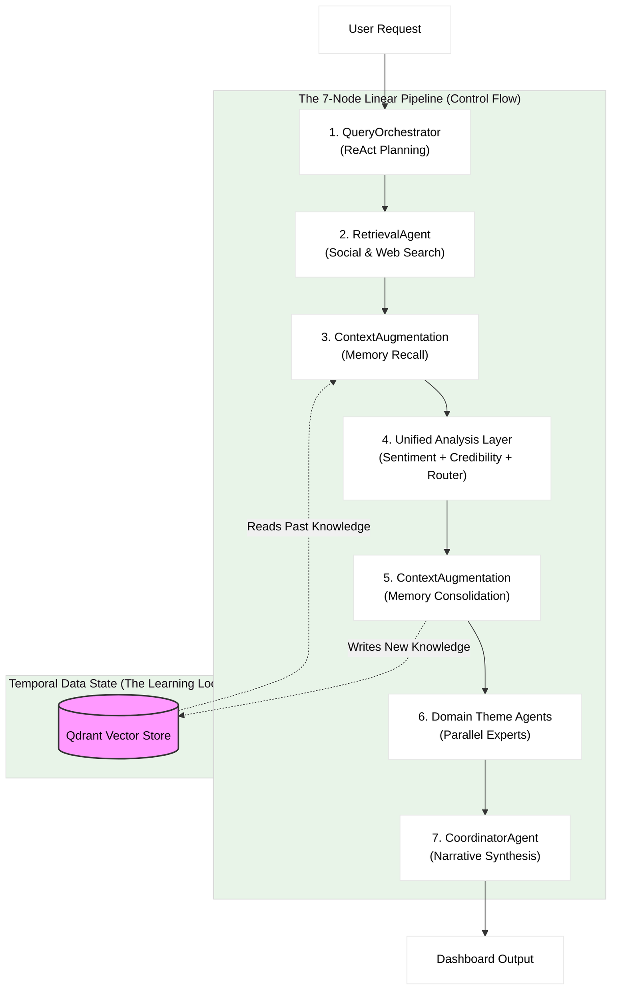

# Hinaing: 7-Node Cognitive Architecture (18-Agent Federated System)
  
> **Thesis Title (Option 1):** 7-Node Agentic Graphs: Multi-Signal Fusion for Verified Context-Aware Public Opinion Synthesis
>
> **Thesis Title (Option 2):** Hinaing: A Neuro-Symbolic Multi-Agent Framework for Epistemic Truth Discovery in Civic Social Listening
>
> **Thesis Title (Option 3):** Hinaing: A Context-Engineered Self-Learning Multi-Agent Agentic AI System with Ensemble Sentiment and 5-Signal Credibility for Public Opinion Analysis in Baguio City
>
> **Thesis Title (Unified):** Hinaing: A 7-node Agentic Graphs Framework for Epistemic Truth Discovery in Civic Social Listening
>
> **Current Implementation:** Hinaing v2.0 (High-Performance 16GB RAM Optimized)
 
> **Thesis Title:** Hinaing: A 7-node Agentic Graphs Framework for Epistemic Truth Discovery in Civic Social Listening
> 
> **Current Implementation:** Hinaing v2.0 (High-Performance 16GB RAM Optimized)
 
**Document Status**: Official Defense Reference
**System Type**: Hierarchical Federated Multi-Agent DAG with Self-Learning Cyclic RAG

---

## 1. Executive Summary for Defense
Hinaing is not a simple "wrapper" around an LLM. It is a **7-Node Cognitive Architecture** comprised of **18 Specialized Agents** organized in a **Hierarchical Federated Multi-Agent DAG with Self-Learning Cyclic RAG**. While the control flow is linear (deterministic latency), the system employs **Episodic Memory Consolidation**, creating a **Temporal Data Cycle** where the output of one analysis run becomes the input memory for the next (Self-Learning Cyclic RAG - Read-Write Memory Loop).

---

## 2. The 18-Agent Breakdown (Federated Hierarchy)

The system represents a **Distributed Cognition** approach, utilizing a **Hierarchical Map-Reduce** pattern to decompose complex analytical tasks.

### Tier 1: Core Executive Agents (Pipeline Orchestration - 7 Agents)
*These agents handle planning, data retrieval, and synthesis.*

| Agent | Responsibility | Complexity |
|-------|----------------|------------|
| **1. QueryOrchestratorAgent** | **The Planner**. Uses ReAct logic to decompose high-level directives into diverse search strategies. | **High** (ReAct) |
| **2. RetrievalAgent** | **The Researcher**. Interfaces with external APIs (Social Media, Web) in parallel batches. | Medium (Async) |
| **3. ContextAugmentationAgent** | **The Memory**. Manages Dual-Directional Memory—Recall and Consolidation. | **High** (Vector/RAG) |
| **4. SentimentAgent** | **The Analyst**. Hybrid Ensemble Agent combining RoBERTa + Gemini. | **High** (Ensemble) |
| **5. CredibilityAgent** | **The Judge**. Coordinates 5 sub-agents for multi-signal verification. | **High** (Multi-Signal) |
| **6. ThemeRouterAgent** | **The Distributor**. Routes documents to domain experts. | Medium (Classification) |
| **7. CoordinatorAgent** | **The Manager (Reducer)**. Synthesizes parallel streams into final narrative. | Medium (Synthesis) |

### Tier 2: Credibility Sub-Agents (5 Agents - Spawned by CredibilityAgent)
*These 5 agents run in parallel within Node 4 to verify source credibility.*

| Agent | Signal | Weight | Method |
|-------|--------|--------|--------|
| **8. DomainTrustAgent** | Domain Reputation | 25% | Lookup table |
| **9. CrossReferenceAgent** | Semantic Corroboration | 20% | BGE Embeddings |
| **10. FactCheckAgent** | External Verification | 15% | Google Fact Check API |
| **11. LLMAnalysisAgent** | Content Quality | 20% | Gemini Analysis |
| **12. TavilyAgent** | Web Cross-Reference | 20% | Tavily Web Search |

### Tier 3: Theme Sub-Agents (6 Agents - Spawned by Node 6)
*These 6 agents run simultaneously via ThreadPoolExecutor.*

| Agent | Domain | Focus Area |
|-------|--------|------------|
| **13. InfrastructureAgent** | Public Works | Roads, Water Supply, Power Grid, Transport |
| **14. HealthAgent** | Public Health | Disease Outbreaks, Hospital Capacity, Sanitation |
| **15. SafetyAgent** | Civil Defense | Crime Rates, Disaster Risk, Emergency Response |
| **16. TourismAgent** | Economy/Visitor | Tourist Influx, Event Management, Traffic Impact |
| **17. EconomyAgent** | Livelihood | Market Vendor Issues, Cost of Living, Employment |
| **18. EnvironmentAgent** | Ecology | Waste Management, Pollution, Green Spaces |

---

## 3. Core Scientific Contributions (The "Novelty")

When asked "What is new here?", cite these three architectural innovations:

### A. Hierarchical Map-Reduce & Parallelism
Unlike standard chatbots that process requests linearly, Hinaing implements a **Map-Reduce** pattern.
*   **Map Phase:** The **Unified Analysis Node** (Node 4) and **Theme Nodes** (Node 6) "fan out" processing to specialized agents in parallel.
*   **Reduce Phase:** The **CoordinatorAgent** (Node 7) synthesizes these parallel streams.
*   *Benefit:* Drastically reduces hallucination by "grounding" each agent in its specific domain context (e.g., The Health Agent ignores traffic data).

### B. Self-Learning Cyclic RAG (Read-Write Memory Loop)
Standard RAG systems are static (Read-Only). Hinaing implements a **Read-Write Memory Loop** that we coin **"Self-Learning Cyclic RAG"**:
1.  **Node 3 (Recall)**: Fetches relevant history *before* analysis.
2.  **Node 5 (Consolidation)**: Writes the *new* analysis back into memory.
*   *Novelty:* This creates a **Temporal Data Cycle** where Run $T$ informs Run $T+1$. The system essentially "sleeps on" its analysis, saving it to long-term memory to be smarter the next time it wakes up.

> **Why DAG over Cyclic Graph?** A Cyclic Graph (autonomous looping) would introduce unbound latency (20+ minutes). The **Query Orchestrator Agent** mitigates the "brittleness" of a linear DAG by using **Context Engineering (emerging concerns)** to maximize success probability in a single pass, eliminating retry loops. This ensures predictable latency (3-5 minutes for 6 themes = 80x speedup over human analysis) while enabling continuous learning.

### C. Ensemble Credibility Verification
We do not rely on the LLM's internal safety filters alone. We implemented an external **5-Signal Verification Protocol** (Fact Check API + Domain Whitelist + Semantic Cross-Reference) managed by the **CredibilityAgent**. This treats "Truth" as a consensus of independent signals, not just probability.

---

## 4. System Architecture: 7-Node Self-Learning DAG Pipeline Diagram

> **Note:** This is a **high-level conceptual diagram** showing the overall/summary pipeline flow and temporal memory loop. For a detailed implementation diagram showing internal agent components, tools, and APIs, see `ARCHITECTURE.md`.

*Note: The arrow from Node 5 to Node 3 represents **Data Dependency** across time, not an execution loop within a single request.*

