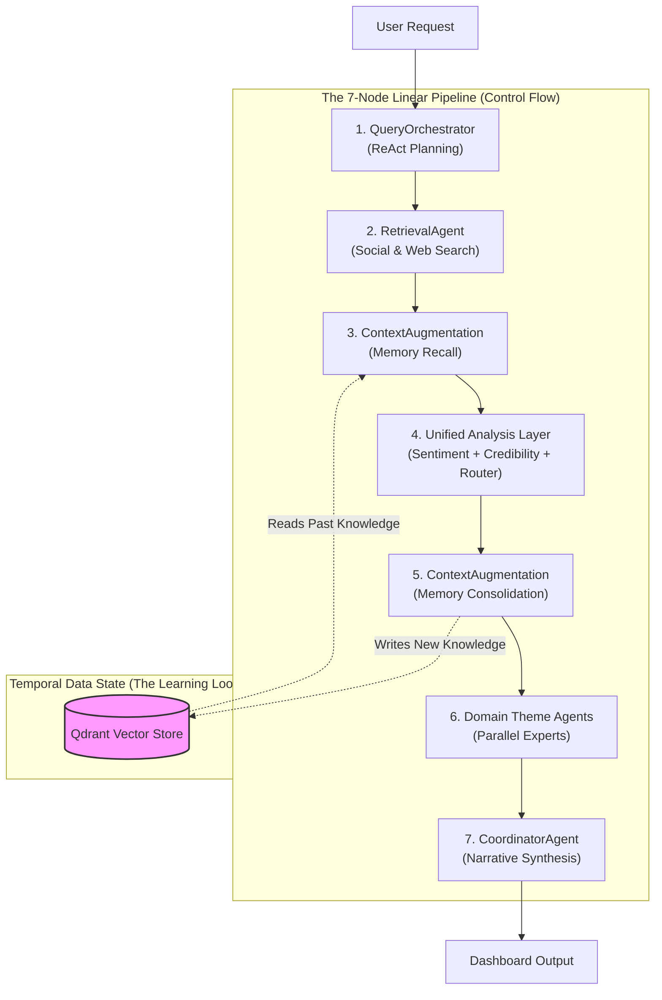

# Hinaing: 7-Node Cognitive Architecture (13-Agent System)
 
> **Thesis Title:** 7-Node Agentic Graphs: Multi-Signal Fusion for Verified Context-Aware Public Opinion Synthesis **OR** Hinaing: A Neuro-Symbolic Multi-Agent Framework for Epistemic Truth Discovery in Civic Social Listening **OR** Hinaing: A Context-Engineered Self-Learning Multi-Agent Agentic AI System with Ensemble Sentiment and 5-Signal Credibility for Public Opinion Analysis in Baguio City
> 
> **Current Implementation:** Hinaing v2.0 (High-Performance 16GB RAM Optimized)
 
**Document Status**: Official Defense Reference
**System Type**: Multi-Agentic System with Hierarchical Map-Reduce Topology

---

## 1. Executive Summary for Defense
Hinaing is not a simple "wrapper" around an LLM. It is a **7-Node Cognitive Architecture** comprised of **13 Specialized Agents** organized in a **Directed Acyclic Graph (DAG)** pipeline. While the control flow is linear (deterministic latency), the system employs **Episodic Memory Consolidation**, creating a **Temporal Data Cycle** where the output of one analysis run becomes the input memory for the next (Self-Learning Cyclic RAG - Read-Write Memory Loop).

---

## 2. The 13-Agent Breakdown

The system represents a **Distributed Cognition** approach, utilizing a **Hierarchical Map-Reduce** pattern to decompose complex analytical tasks.

### Tier 1: The Executive Agents (Pipeline Management)
*These agents handle planning, data retrieval, and synthesis.*

| Agent | Responsibility | Complexity |
|-------|----------------|------------|
| **1. QueryOrchestratorAgent** | **The Planner**. Uses ReAct logic to decompose high-level directives (e.g., "Analyze Baguio") into diverse, specific search strategies strategies (e.g., "Baguio medical shortage", "Session road traffic"). | **High** (ReAct) |
| **2. RetrievalAgent** | **The Researcher**. A tool-enabled agent that interfaces with external APIs (Social Media, Web) in parallel batches to fetch raw data. | Medium (Async) |
| **3. ContextAugmentationAgent** | **The Memory**. Manages the RAG pipeline. Novel contribution: It performs **Dual-Directional Memory** operations—*Recall* (fetching past learnings) and *Consolidation* (writing new learnings). | **High** (Vector/RAG) |
| **4. CoordinatorAgent** | **The Manager (Reducer)**. Synthesizes conflicting data points from all other agents into a coherent final narrative and structural dashboard. | Medium (Synthesis) |

### Tier 2: The Specialist Agents (Map Phase: Analysis and Verification)
*These agents apply specific analytical frameworks to the raw data in parallel (Fan-Out).*

| Agent | Responsibility | Complexity |
|-------|----------------|------------|
| **5. SentimentAgent** | **The Analyst**. A Hybrid Ensemble Agent. It combines a local **RoBERTa** model (for speed/consistency) with **Gemini Connect** (for nuance) to grade public emotion with higher accuracy than single models. | **High** (Ensemble) |
| **6. CredibilityAgent** | **The Judge**. A "Safety" agent that cross-references 5 distinct signals (Domain Trust, Fact Check API, Semantic Consistency, etc.) to detect misinformation before it reaches the consensus layer. | **High** (Multi-Signal) |
| **7. ThemeRouterAgent** | **The Distributor**. A "Sorting Hat" classification agent that analyzes semantic content to route documents to the appropriate domain expert(s) below. | Medium (Classification) |

### Tier 3: The Domain Experts (Map Phase: Theme Specific)
*These 6 agents run simultaneously via ThreadPoolExecutor to provide deep, sector-specific expertise.*

| Agent | Domain | Focus Area |
|-------|--------|------------|
| **8. Infrastructure Agent** | **Public Works** | Roads, Water Supply, Power Grid, Transport |
| **9. Health Agent** | **Public Health** | Disease Outbreaks (Dengue), Hospital Capacity, Sanitation |
| **10. Safety Agent** | **Civil Defense** | Crime Rates, Disaster Risk (Landslides), Emergency Response |
| **11. Tourism Agent** | **Economy/Visitor** | Tourist Influx, Event Management (Panagbenga), Traffic Impact |
| **12. Economy Agent** | **Livelihood** | Market Vendor Issues, Cost of Living, Employment |
| **13. Environment Agent** | **Ecology** | Waste Management, Pollution, Green Spaces |

---

## 3. Core Scientific Contributions (The "Novelty")

When asked "What is new here?", cite these three architectural innovations:

### A. Hierarchical Map-Reduce & Parallelism
Unlike standard chatbots that process requests linearly, Hinaing implements a **Map-Reduce** pattern.
*   **Map Phase:** The **Unified Analysis Node** (Node 4) and **Theme Nodes** (Node 6) "fan out" processing to specialized agents in parallel.
*   **Reduce Phase:** The **CoordinatorAgent** (Node 7) synthesizes these parallel streams.
*   *Benefit:* Drastically reduces hallucination by "grounding" each agent in its specific domain context (e.g., The Health Agent ignores traffic data).

### B. Self-Learning Cyclic RAG (Read-Write Memory Loop)
Standard RAG systems are static (Read-Only). Hinaing implements a **Read-Write Memory Loop** that we coin **"Self-Learning Cyclic RAG"**:
1.  **Node 3 (Recall)**: Fetches relevant history *before* analysis.
2.  **Node 5 (Consolidation)**: Writes the *new* analysis back into memory.
*   *Novelty:* This creates a **Temporal Data Cycle** where Run $T$ informs Run $T+1$. The system essentially "sleeps on" its analysis, saving it to long-term memory to be smarter the next time it wakes up.

> **Why DAG over Cyclic Graph?** A Cyclic Graph (autonomous looping) would introduce unbound latency (20+ minutes). The **Query Orchestrator Agent** mitigates the "brittleness" of a linear DAG by using **Context Engineering (Keyword Clusters)** to maximize success probability in a single pass, eliminating retry loops. This ensures predictable latency (3-5 minutes for 6 themes = 80x speedup over human analysis) while enabling continuous learning.

### C. Ensemble Credibility Verification
We do not rely on the LLM's internal safety filters alone. We implemented an external **5-Signal Verification Protocol** (Fact Check API + Domain Whitelist + Semantic Cross-Reference) managed by the **CredibilityAgent**. This treats "Truth" as a consensus of independent signals, not just probability.

---

## 4. System Architecture: 7-Node Self-Learning DAG Pipeline Diagram

> **Note:** This is a **high-level conceptual diagram** showing the overall/summary pipeline flow and temporal memory loop. For a detailed implementation diagram showing internal agent components, tools, and APIs, see `ARCHITECTURE.md`.

*Note: The arrow from Node 5 to Node 3 represents **Data Dependency** across time, not an execution loop within a single request.*
