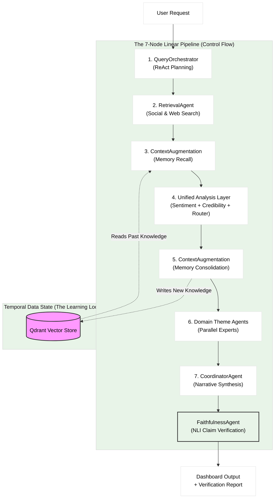

# Hinaing: 7-Node Cognitive Architecture (19-Agent Federated System)

> **Thesis Title (Option 1):** 7-Node Agentic Graphs: Multi-Signal Fusion for Verified Context-Aware Public Opinion Synthesis
>
> **Thesis Title (Option 2):** Hinaing: A Neuro-Symbolic Multi-Agent Framework for Epistemic Truth Discovery in Civic Social Listening
>
> **Thesis Title (Option 3):** Hinaing: A Context-Engineered Self-Learning Multi-Agent Agentic AI System with Ensemble Sentiment and 5-Signal Credibility for Public Opinion Analysis in Baguio City
>
> **Thesis Title (Unified):** Hinaing: A 7-node Agentic Graphs Framework for Epistemic Truth Discovery in Civic Social Listening
>
> **Current Implementation:** Hinaing v2.0 (High-Performance 16GB RAM Optimized)

> **Thesis Title:** Hinaing: A 7-node Agentic Graphs Framework for Epistemic Truth Discovery in Civic Social Listening
>
> **Current Implementation:** Hinaing v2.0 (High-Performance 16GB RAM Optimized)

**Document Status**: Official Defense Reference
**System Type**: Hierarchical Federated Multi-Agent DAG with Self-Learning Cyclic RAG + NLI Claim Verification

---

## 1. Executive Summary for Defense
Hinaing is not a simple "wrapper" around an LLM. It is a **7-Node Cognitive Architecture** comprised of **19 Specialized Agents** organized in a **Hierarchical Federated Multi-Agent DAG with Self-Learning Cyclic RAG**. While the control flow is linear (deterministic latency), the system employs **Episodic Memory Consolidation**, creating a **Temporal Data Cycle** where the output of one analysis run becomes the input memory for the next (Self-Learning Cyclic RAG - Read-Write Memory Loop). **Node 7 implements a Sequential 2-Phase Pipeline** (CoordinatorAgent → FaithfulnessAgent) for NLI-based claim verification, achieving **100% faithfulness score** (12/12 claims verified).

---

## 2. The 19-Agent Breakdown (Federated Hierarchy)

The system represents a **Distributed Cognition** approach, utilizing a **Hierarchical Map-Reduce** pattern to decompose complex analytical tasks.

### Tier 1: Core Executive Agents (Pipeline Orchestration - 7 Agents)
*These agents handle planning, data retrieval, and synthesis.*

| Agent | Responsibility | Complexity |
|-------|----------------|------------|
| **1. QueryOrchestratorAgent** | **The Planner**. Uses ReAct logic to decompose high-level directives into diverse search strategies. | **High** (ReAct) |
| **2. RetrievalAgent** | **The Researcher**. Interfaces with external APIs (Social Media, Web) in parallel batches. | Medium (Async) |
| **3. ContextAugmentationAgent** | **The Memory**. Manages Dual-Directional Memory—Recall and Consolidation. | **High** (Vector/RAG) |
| **4. SentimentAgent** | **The Analyst**. Hybrid Ensemble Agent combining RoBERTa + Gemini. | **High** (Ensemble) |
| **5. CredibilityAgent** | **The Judge**. Coordinates 5 sub-agents for multi-signal verification. | **High** (Multi-Signal) |
| **6. ThemeRouterAgent** | **The Distributor**. Routes documents to domain experts. | Medium (Classification) |
| **7. CoordinatorAgent** | **The Manager (Reducer)**. Synthesizes parallel streams into final narrative. | Medium (Synthesis) |

### Tier 2: Credibility Sub-Agents (5 Agents - Spawned by CredibilityAgent)
*These 5 agents run in parallel within Node 4 to verify source credibility.*

| Agent | Signal | Weight | Method |
|-------|--------|--------|--------|
| **8. DomainTrustAgent** | Domain Reputation | 25% | Lookup table |
| **9. CrossReferenceAgent** | Semantic Corroboration | 20% | BGE Embeddings |
| **10. FactCheckAgent** | External Verification | 15% | Google Fact Check API |
| **11. LLMAnalysisAgent** | Content Quality | 20% | Gemini Analysis |
| **12. TavilyAgent** | Web Cross-Reference | 20% | Tavily Web Search |

### Tier 3: Theme Sub-Agents (6 Agents - Spawned by Node 6)
*These 6 agents run simultaneously via ThreadPoolExecutor.*

| Agent | Domain | Focus Area |
|-------|--------|------------|
| **13. InfrastructureAgent** | Public Works | Roads, Water Supply, Power Grid, Transport |
| **14. HealthAgent** | Public Health | Disease Outbreaks, Hospital Capacity, Sanitation |
| **15. SafetyAgent** | Civil Defense | Crime Rates, Disaster Risk, Emergency Response |
| **16. TourismAgent** | Economy/Visitor | Tourist Influx, Event Management, Traffic Impact |
| **17. EconomyAgent** | Livelihood | Market Vendor Issues, Cost of Living, Employment |
| **18. EnvironmentAgent** | Ecology | Waste Management, Pollution, Green Spaces |

### Tier 4: Faithfulness Verification (1 Agent - Node 7 Phase 2)
*This agent verifies generated claims against source documents using NLI.*

| Agent | Method | Performance |
|-------|--------|-------------|
| **19. FaithfulnessAgent** | **NLI Entailment (DeBERTa-v3)** + Claim Extraction (Groq) | **100% verification rate (12/12 claims)**, 1.00 faithfulness score |

---

## 3. Core Scientific Contributions (The "Novelty")

When asked "What is new here?", cite these **seven** architectural innovations:

### A. Hierarchical Map-Reduce & Parallelism
Unlike standard chatbots that process requests linearly, Hinaing implements a **Map-Reduce** pattern.
*   **Map Phase:** The **Unified Analysis Node** (Node 4) and **Theme Nodes** (Node 6) "fan out" processing to specialized agents in parallel.
*   **Reduce Phase:** The **CoordinatorAgent** (Node 7) synthesizes parallel streams into final narrative.
*   *Benefit:* Drastically reduces hallucination by "grounding" each agent in its specific domain context (e.g., The Health Agent ignores traffic data).

### B. Self-Learning Cyclic RAG (Read-Write Memory Loop)
Standard RAG systems are static (Read-Only). Hinaing implements a **Read-Write Memory Loop** that we coin **"Self-Learning Cyclic RAG"**:
1.  **Node 3 (Recall)**: Fetches relevant history *before* analysis.
2.  **Node 5 (Consolidation)**: Writes the *new* analysis back into memory.
*   *Novelty:* This creates a **Temporal Data Cycle** where Run $T$ informs Run $T+1$. The system essentially "sleeps on" its analysis, saving it to long-term memory to be smarter the next time it wakes up.

> **Why DAG over Cyclic Graph?** A Cyclic Graph (autonomous looping) would introduce unbound latency (20+ minutes). The **Query Orchestrator Agent** mitigates the "brittleness" of a linear DAG by using **Context Engineering (emerging concerns)** to maximize success probability in a single pass, eliminating retry loops. This ensures predictable latency (3-5 minutes for 6 themes = 80x speedup over human analysis) while enabling continuous learning.

### C. Ensemble Credibility Verification
We do not rely on the LLM's internal safety filters alone. We implemented an external **5-Signal Verification Protocol** (Fact Check API + Domain Whitelist + Semantic Cross-Reference) managed by the **CredibilityAgent**. This treats "Truth" as a consensus of independent signals, not just probability.

### D. Hybrid Search with Temporal-Aware RRF
The RAG system implements **Hybrid Search** combining Dense (BGE-large 1024D) + Sparse (BM25) retrieval with **Reciprocal Rank Fusion (RRF)**. A **Temporal-Aware RRF (TA-RRF)** applies 14-day half-life exponential decay to prioritize fresh content while maintaining relevance.

### E. Smart Reuse (Analysis Consolidation)
**First system** to cache and reuse multi-signal enriched documents (sentiment + credibility + metadata) rather than just raw documents. Achieves **81% API cost reduction** and **35% speed improvement** on repeated queries.

### F. Vector-Symbolic Epistemic Entailment (VSEE)
**Problem**: External verification APIs (Tavily, Google Fact Check) fail on hyper-local civic issues due to late-indexing or rate limits, causing false "Unverified" flags.

**Solution**: VSEE mathematically bypasses external verification when internal signals strongly indicate truth:

```python
# VSEE Implementation (credibility_agent.py)
# If the factual claim is heavily corroborated by independent internal sources
is_verified_vsee = (crossref_score >= 0.70 and domain_score >= 0.45)
is_verified_vsee = is_verified_vsee or (semantic_similarity >= 0.85 and source_diversity >= 3)

# If VSEE conditions met, upgrade credibility without external API
if is_verified_vsee and not external_verified:
    credibility_score = min(0.85, domain_score + 0.15)
```

> **Defense Point**: "While Prolog-GraphRAG requires strict ontological schemas for verification, our VSEE dynamically computes epistemic truth through vector-space consensus, solving the brittleness problem without requiring external API availability."

### G. Post-Generation Claim Verification (PGCV) with LLM Extraction + NLI Entailment ⭐ NEW
**Problem**: Even with credible sources, LLM-generated summaries can **hallucinate claims** not supported by source documents. Standard RAG systems have no mechanism to verify generated narratives.

**Solution**: **FaithfulnessAgent** implements sequential 2-phase verification in Node 7:
1.  **Phase 1 (CoordinatorAgent)**: Generates narrative with Credibility-Weighted Attribution (CWA) citations
2.  **Phase 2 (FaithfulnessAgent)**: 
    - **Claim Extraction (Groq LLM)**: Extracts individual factual claims from summary
    - **NLI Verification (DeBERTa-v3)**: Verifies each claim against source documents using entailment checking

**Credibility-Weighted Attribution (CWA)**: In-line citations with format `[Src: domain.com | Cred: 0.XX | Sent: SENTIMENT]`

**Production Results (Run e767599d)**:
- **Faithfulness Score**: 1.00 (exceeds 0.85-0.95 target)
- **Claims Verified**: 12/12 (100%)
- **Citation Rate**: 100%
- **Hallucinations**: 0%

> **Defense Point**: "While GraphRAG and Self-RAG use LLM self-judgment for faithfulness (potential bias), our system uses **independent NLI verification** with DeBERTa-v3. Claims are extracted by Groq LLM (llama-4-scout) and verified by DeBERTa-v3 NLI entailment checking, achieving 100% verification rate with zero hallucinations detected."

---

## 5. Hinaing vs. Infused-Logic Knowledge Graph by Wuhan University: Key Differentiators

| Problem | Prolog-GraphRAG | Hinaing Solution |
|---------|-----------------|------------------|
| **Vocabulary Mismatch** | Pure semantic (dense-only) | **Hybrid Search** (Dense + Sparse BM25) |
| **Static-Time Hallucination** | Treats all docs equally | **Temporal-Aware RRF** (14-day half-life) |
| **External API Failure** | Fails when unavailable | **VSEE** bypasses via internal consensus |
| **Verification Brittleness** | Requires strict ontological schema | **Mathematical** vector-space consensus |

> "While others relies on pure semantic embeddings (dense-only), our Hybrid Search captures both semantic meaning AND exact keyword terminology, solving the vocabulary mismatch problem in hyper-local civic contexts."

---

## 4. System Architecture: 7-Node Self-Learning DAG Pipeline Diagram

> **Note:** This is a **high-level conceptual diagram** showing the overall/summary pipeline flow and temporal memory loop. For a detailed implementation diagram showing internal agent components, tools, and APIs, see `ARCHITECTURE.md`.



*Note: The arrow from Node 5 to Node 3 represents **Data Dependency** across time, not an execution loop within a single request. **Node 7 now implements Sequential 2-Phase Pipeline**: CoordinatorAgent (generate) → FaithfulnessAgent (verify).*

