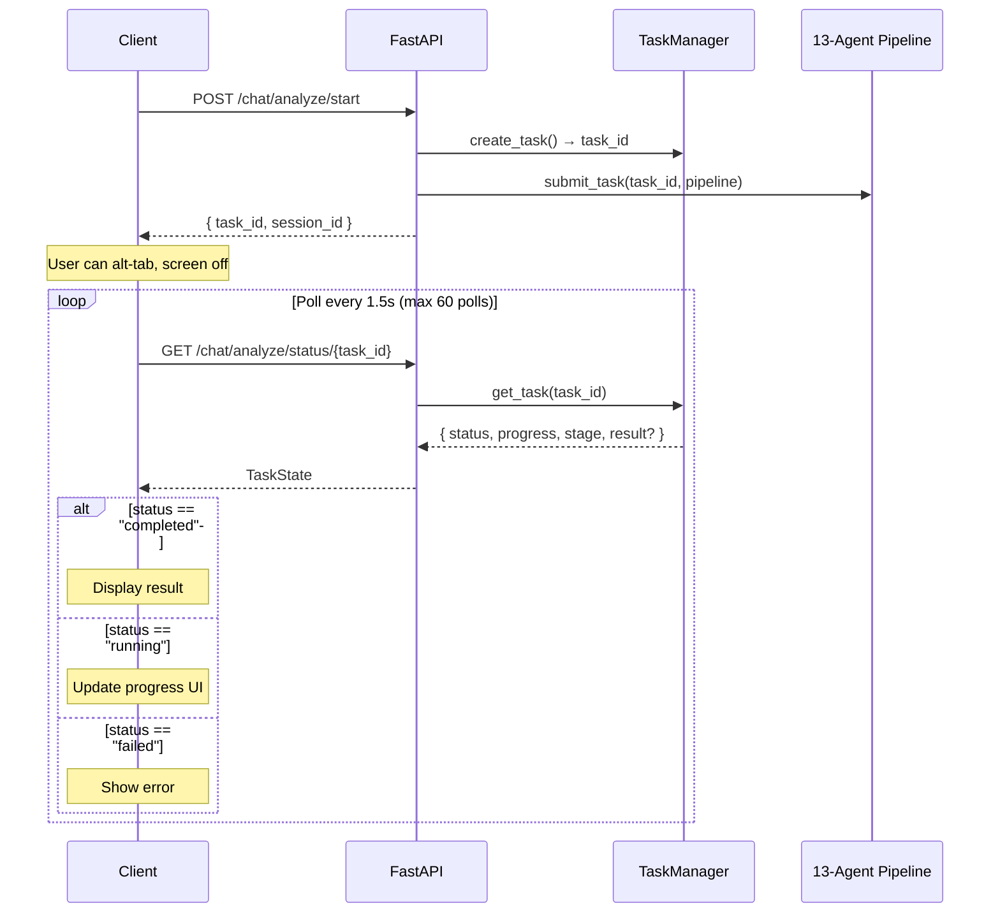
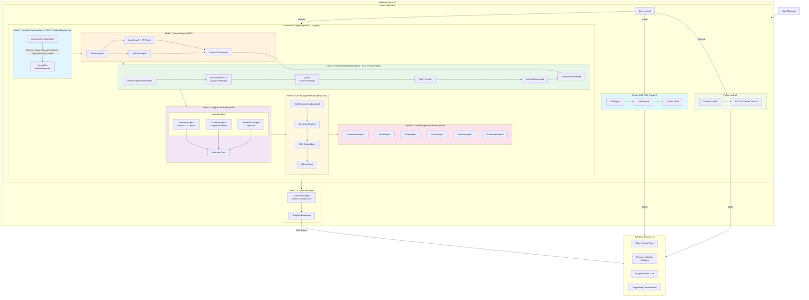
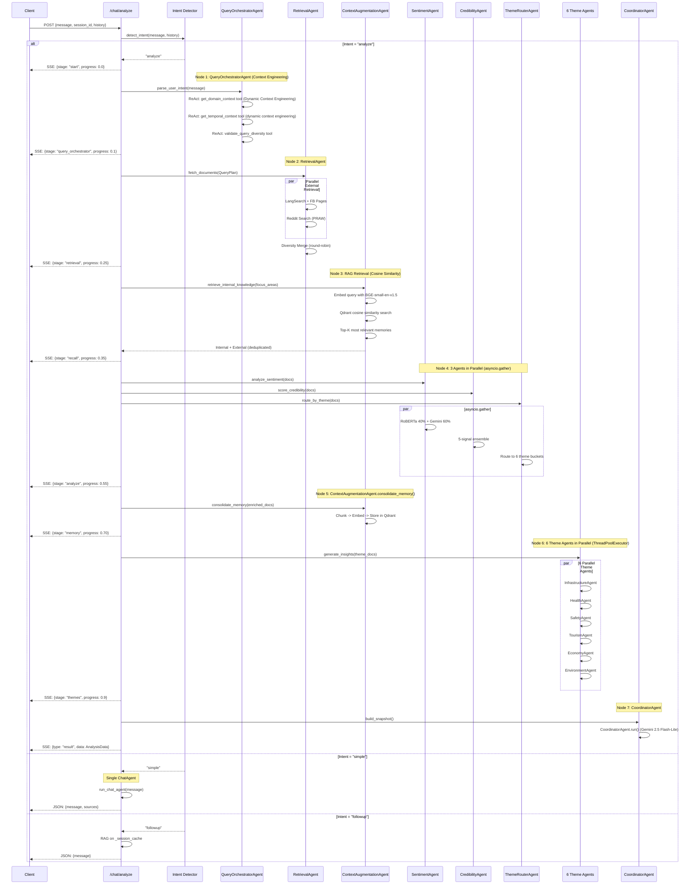
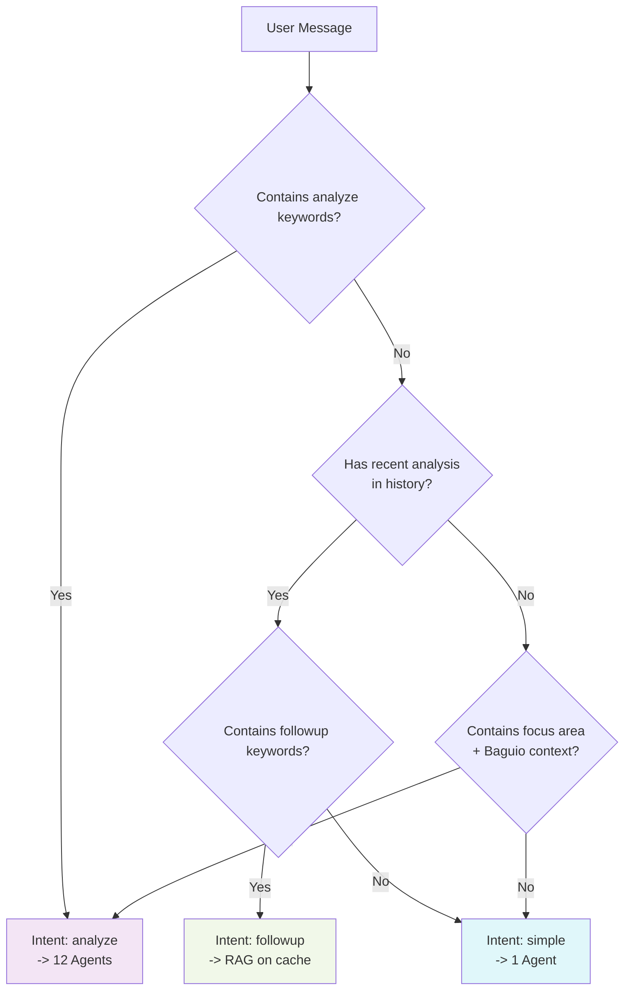
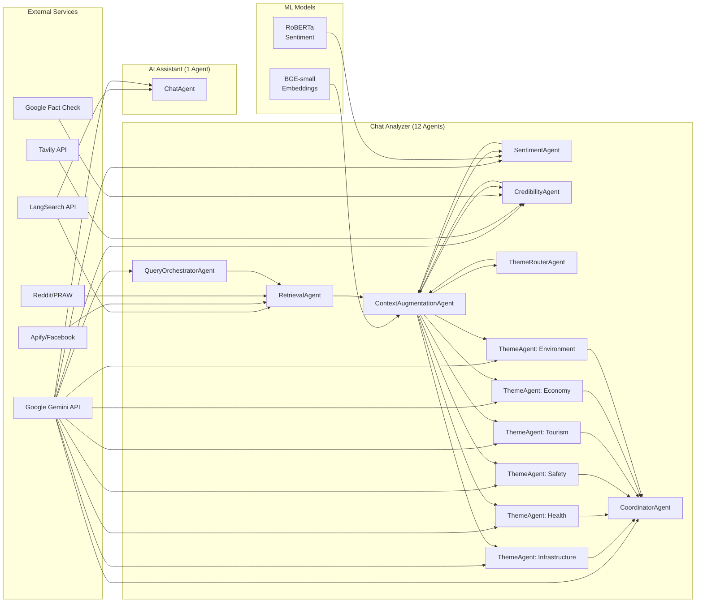
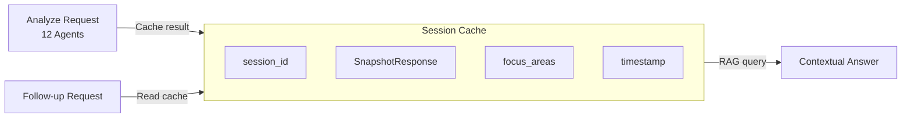

# Chat Systems Architecture

> **Thesis Title (Option 1):** 7-Node Agentic Graphs: Multi-Signal Fusion for Verified Context-Aware Public Opinion Synthesis
>
> **Thesis Title (Option 2):** Hinaing: A Neuro-Symbolic Multi-Agent Framework for Epistemic Truth Discovery in Civic Social Listening
>
> **Thesis Title (Option 3):** Hinaing: A Context-Engineered Self-Learning Multi-Agent Agentic AI System with Ensemble Sentiment and 5-Signal Credibility for Public Opinion Analysis in Baguio City
>
> **Thesis Title (Unified):** Hinaing: A 7-node Agentic Graphs Framework for Epistemic Truth Discovery in Civic Social Listening

> **Context Engineering**: The entire 7-node architecture is a form of context engineering - we design the pipeline structure, agent specializations, emerging concerns, theme definitions, and credibility signals to inject domain-specific knowledge into the system.

> **Thesis Title:** Hinaing: A 7-node Agentic Graphs Framework for Epistemic Truth Discovery in Civic Social Listening

> **Context Engineering**: The entire 7-node architecture is a form of context engineering - we design the pipeline structure, agent specializations, emerging concerns, theme definitions, and credibility signals to inject domain-specific knowledge into the system.

## Overview

Hinaing provides two distinct chat interfaces with different agent architectures:

| Feature | Chat Analyzer (13 Agents) | AI Assistant (1 Agent) |
|---------|---------------------------|------------------------|
| **Purpose** | Deep sentiment analysis | Quick Q&A |
| **Endpoint** | `POST /chat/analyze/start` | `POST /chat/` |
| **Response** | Background Task + Polling | Sync JSON |
| **Agent Count** | **13** (7 core + 6 theme) | **1** (ChatAgent) |
| **Pipeline** | 7-node multi-agent | Single LLM + tool call |
| **Latency** | 15-30 seconds | 2-5 seconds |
| **Memory** | Persistent (Qdrant) | None |

## Mobile-Resilient Architecture

The Chat Analyzer uses a **Background Task + Polling** pattern that survives:
- Mobile alt-tab / screen off
- Network interruptions
- Browser tab suspension



### API Endpoints

| Endpoint | Method | Purpose |
|----------|--------|---------|
| `/chat/analyze/start` | POST | Start background analysis, returns `task_id` |
| `/chat/analyze/status/{task_id}` | GET | Poll for progress and result |
| `/chat/analyze` | POST | Legacy SSE streaming (deprecated) |
| `/chat/analyze/sync` | POST | Synchronous (blocking) analysis |

## Agent Summary

### Chat Analyzer Agents (13 Total)

| Category | Count | Agents |
|----------|-------|--------|
| **Core Pipeline** | 7 | QueryOrchestratorAgent, RetrievalAgent, SentimentAgent, CredibilityAgent, ContextAugmentationAgent, ThemeRouterAgent, CoordinatorAgent |
| **Theme Sub-Agents** | 6 | InfrastructureAgent, HealthAgent, SafetyAgent, TourismAgent, EconomyAgent, EnvironmentAgent |

### AI Assistant Agent (1 Total)

| Agent | Function |
|-------|----------|
| **ChatAgent** | Single ReAct agent with LangSearch tool for quick Q&A |

---

## Chat Analyzer System Flow (13 Agents)



---

## Chat Analyzer Sequence Diagram (13 Agents)



---

## AI Assistant Architecture (1 Agent)

**Important**: The Chat Agent uses **Groq** (not Gemini) as the primary LLM provider for fast inference.

```mermaid
flowchart TB
    subgraph Frontend["Frontend (Next.js 15)"]
        ChatUI[Chat Page]
        MsgBubble[Message Bubbles]
        SourceBadges[Source Badges]
    end

    subgraph Backend["Backend (FastAPI)"]
        subgraph SingleAgent["ChatAgent (1 Agent)"]
            CA[ChatAgent]
            GF[Groq (llama-3.3-70b)]
            ID[Intent Detection]
            CA --> GF --> ID
        end

        subgraph Search["LangSearch Client"]
            LS[LangSearch API<br/>30-day window]
            LS --> |web docs| CA
        end

        ID --> |greeting/identity| Direct[Direct Response]
        ID --> |civic question| Search
        Search --> |grounded prompt| GF
        GF --> |final_response| Response[JSON Response + Sources]
    end

    Request[User Message + History] --> SingleAgent
    Response --> Frontend

    style SingleAgent fill:#e1f5fe
    style Search fill:#fff3e0
    style Direct fill:#f1f8e9
```

### Chat Agent Specifications

| Aspect | Implementation |
|--------|----------------|
| **LLM Provider** | **Groq** (`groq/compound` - llama-3.3-70b) |
| **Retrieval** | LangSearch web search ONLY (30-day window) |
| **Memory** | Conversation buffer (last 6 messages) - **NO Qdrant** |
| **Intent Detection** | Keyword-based (greeting, identity, civic, sentiment) |
| **Latency** | 1-2 seconds |
| **Verification** | None (LLM grounding only) |
| **Sentiment Analysis** | None |

### Dead Code (Not Used)

The following are defined but **NEVER called** in production:

```python
# Imported but never used
from ..agents.context_agent import ContextAugmentationAgent  # ← Never called

# Defined but never called
context_agent = ContextAugmentationAgent()  # ← Dead code
def search_sentiment_data(...)  # ← Dead code
tools_map = {...}  # ← Dead code
def _is_sentiment_query(...)  # ← Dead code
```

**Actual retrieval flow**:
```python
# Line 209: ONLY retrieval call
search_client = LangSearchClient()
web_docs = await search_client.search(query=fresh_query, time_window="30d", limit=20)
```

---

## Agent Comparison: Chat Analyzer vs AI Assistant

| Aspect | Chat Analyzer (13 Agents) | AI Assistant (1 Agent) |
|--------|---------------------------|------------------------|
| **QueryOrchestratorAgent** | ✅ ReAct with 3 tools (context engineering) | ❌ None |
| **RetrievalAgent** | ✅ LangSearch + FB + Reddit | ⚠️ LangSearch + Memory |
| **ContextAugmentationAgent** | ✅ Memory recall + consolidation | ⚠️ Memory recall only (via tool) |
| **SentimentAgent** | ✅ RoBERTa + Gemini ensemble | ❌ None |
| **CredibilityAgent** | ✅ 5-signal framework | ❌ None |
| **ThemeRouterAgent** | ✅ 6 theme buckets | ❌ None |
| **6 Theme Agents** | ✅ Parallel Gemini | ❌ None |
| **ChatAgent** | ❌ Not used | ✅ Single agent |
| **Memory** | ✅ Qdrant persistent | ✅ Read-only RAG |
| **Parallelization** | ✅ Nodes 4 + 6 | ❌ None |

---

## Intent Detection Logic



### Intent Keywords

| Intent | Keywords | Agent Path |
|--------|----------|------------|
| **analyze** | "analyze", "sentiment", "public opinion", "civic sentiment" | 12 Agents |
| **followup** | "tell me more", "explain", "why", "sources" | RAG on cache |
| **simple** | Default (no analysis keywords) | 1 Agent (ChatAgent) |

---

## Streaming Response Format (13 Agents)


---

## Component Architecture (13 Agents)



---

## Agent File Structure

```
backend/
├── app/
│   ├── routers/
│   │   ├── chat_analyze.py      # /chat/analyze - 12 Agents (Streaming SSE)
│   │   └── chat.py              # /chat/ - 1 Agent (Sync JSON)
│   ├── services/
│   │   ├── agents/
│   │   │   ├── chat_agent.py           # ChatAgent (AI Assistant)
│   │   │   ├── query_orchestrator.py   # QueryOrchestratorAgent
│   │   │   ├── sentiment_agent.py      # SentimentAgent
│   │   │   ├── credibility_agent.py    # CredibilityAgent
│   │   │   ├── context_agent.py        # ContextAugmentationAgent
│   │   │   ├── theme_agent.py          # 6 Theme Agents
│   │   │   └── gemini.py               # ReAct agent utilities
│   │   ├── insights/
│   │   │   ├── graph.py         # 7-Node LangGraph workflow
│   │   │   ├── agents.py        # RetrievalAgent, ThemeRouterAgent
│   │   │   └── agent_tools.py   # Tool implementations
│   │   ├── rag/
│   │   │   ├── chunker.py       # Semantic chunking
│   │   │   ├── embeddings.py    # BGE service
│   │   │   └── vector_store.py  # Qdrant client
│   │   ├── ingestion/
│   │   │   ├── reddit.py        # PRAW integration
│   │   │   └── facebook.py      # Apify integration
│   │   └── langsearch.py        # Web search + FB enrichment
```

---

## Performance Comparison

| Metric | Chat Analyzer (13 Agents) | AI Assistant (1 Agent) |
|--------|---------------------------|------------------------|
| Agent Count | **13** | **1** |
| Avg Latency | 15-30s | 2-5s |
| Documents Processed | Up to 100 | Up to 5 |
| LLM Calls | 8-12 | 1-2 |
| Streaming | Yes (SSE) | No |
| Memory | Persistent (Qdrant) | None |
| Sentiment Scoring | Yes (ensemble) | No |
| Credibility Scoring | Yes (5-signal) | No |
| Structured Output | Yes | Text + Sources |
| Parallelization | Nodes 4 + 6 | None |

---

## Session Management



Chat Analyzer maintains in-memory session cache:
- Stores analysis results by `session_id`
- Enables follow-up questions without re-running 13-agent pipeline
- Uses Gemini RAG on cached `SnapshotResponse`

