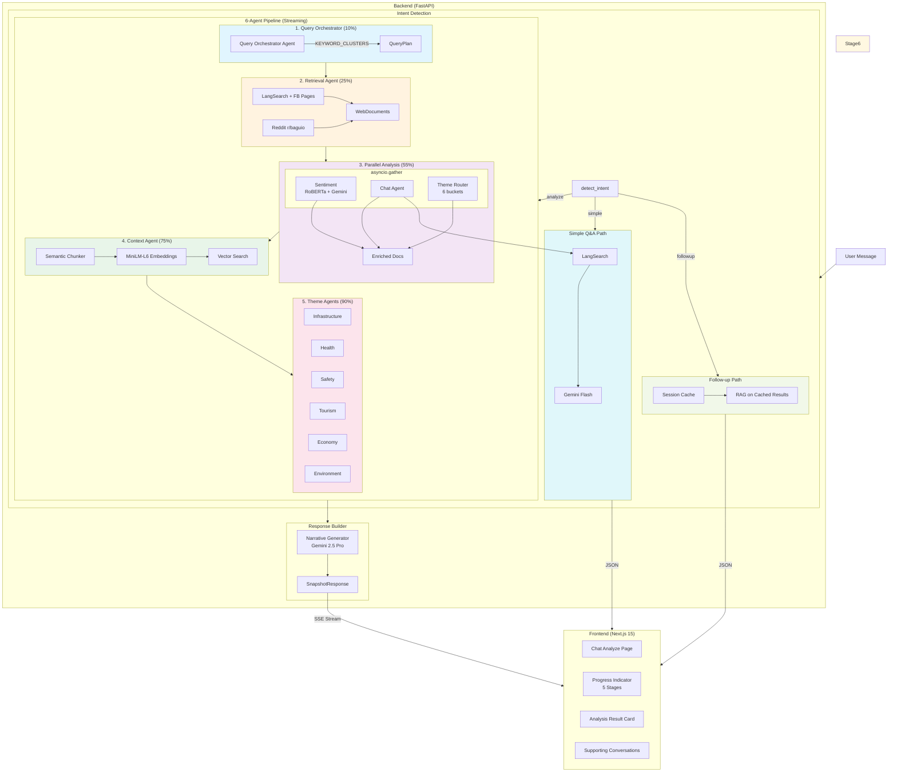
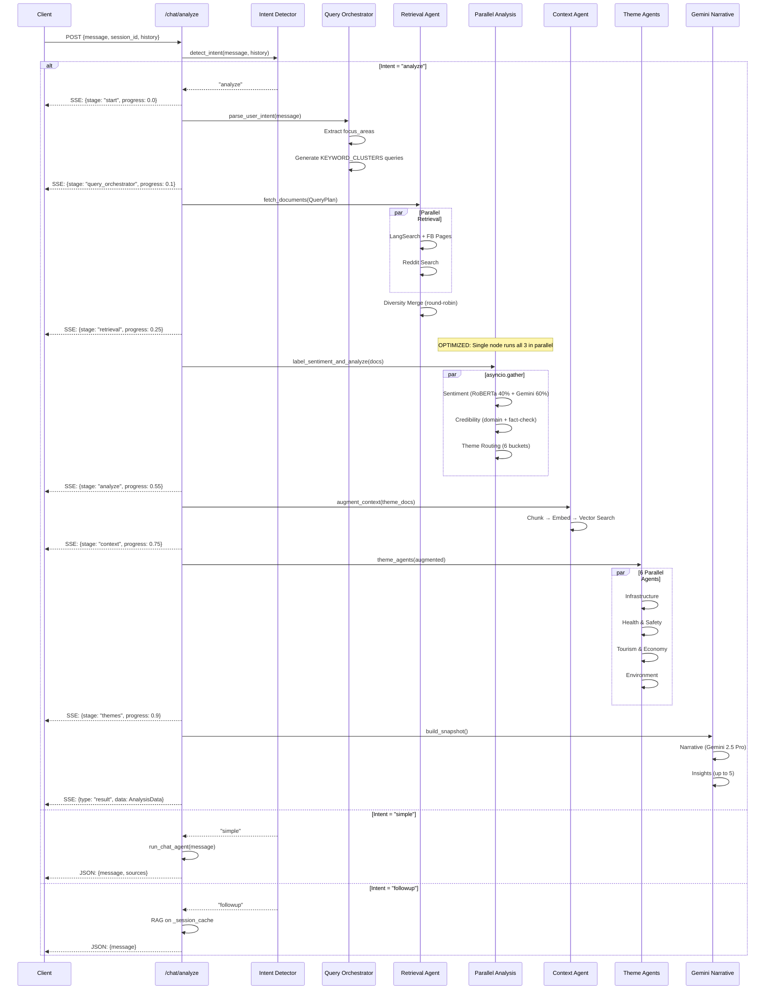
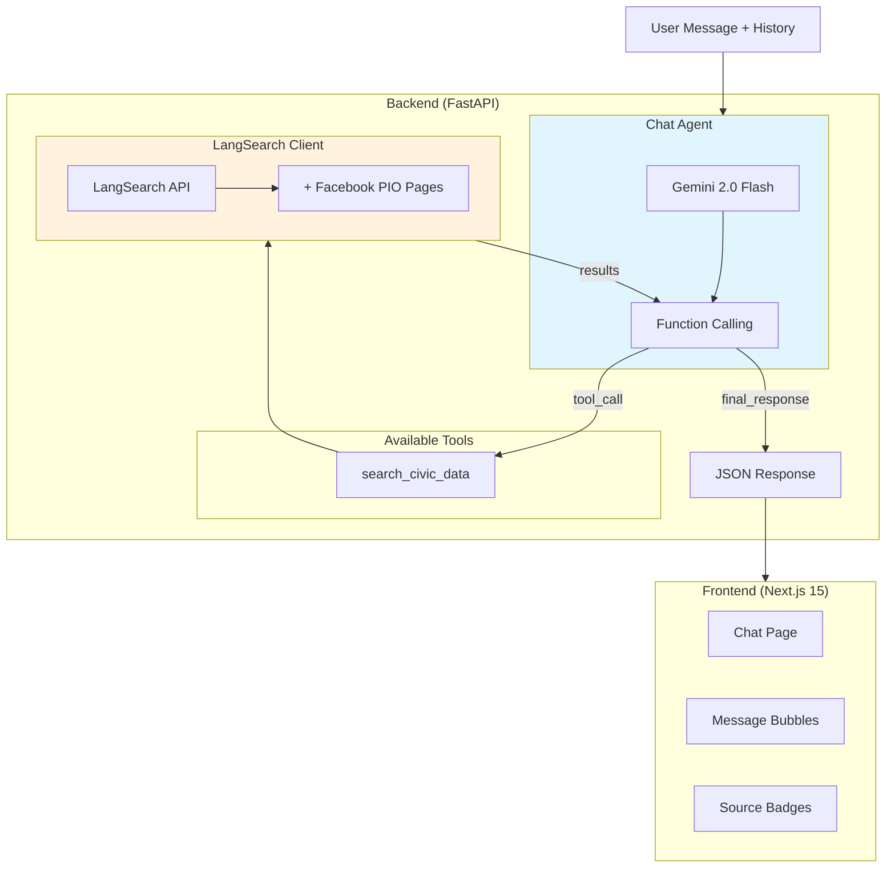
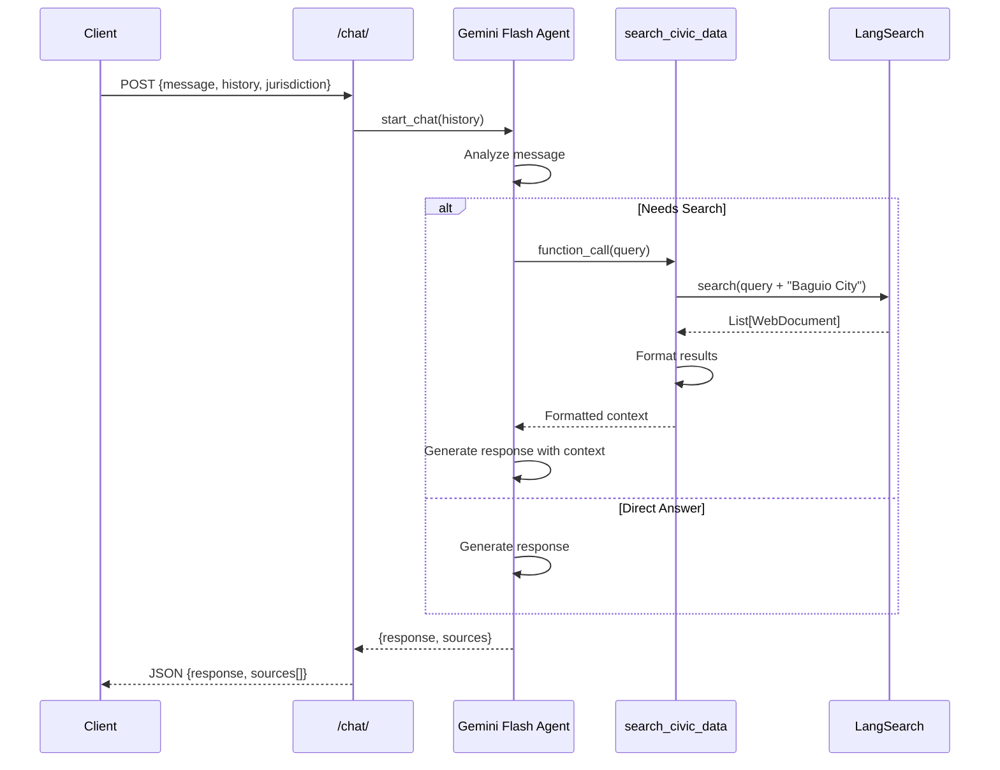
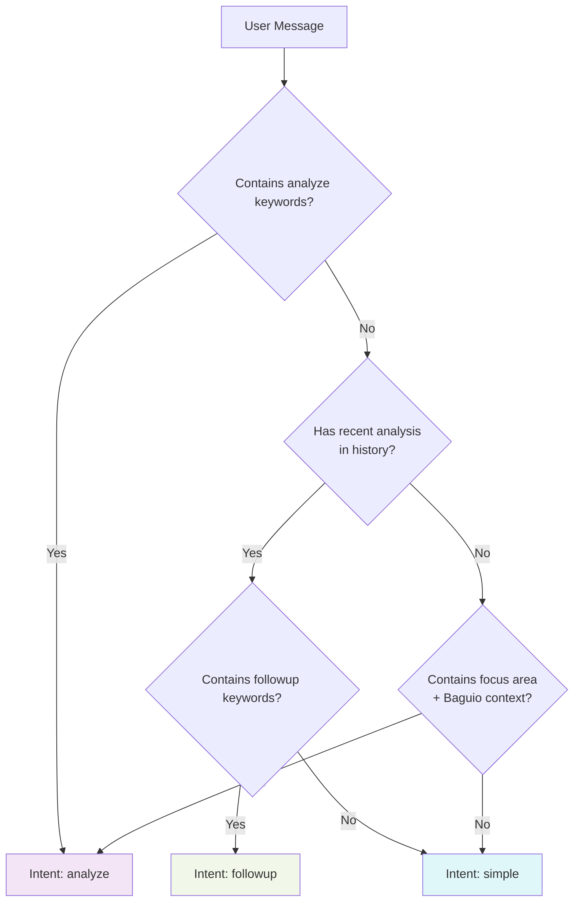
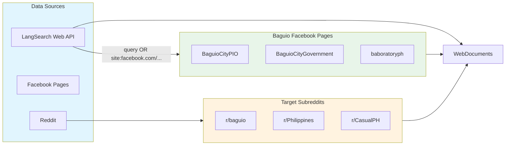
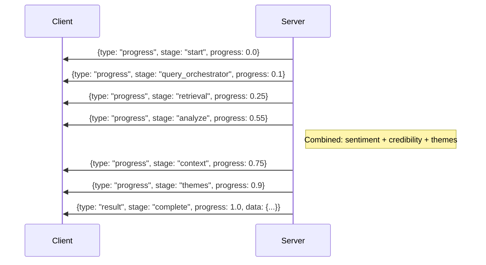
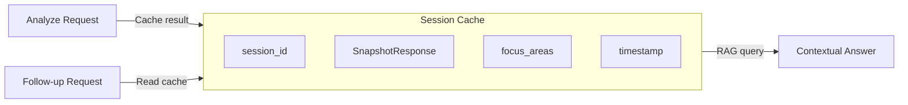

# Chat Systems Architecture

## Overview

Hinaing provides two distinct chat interfaces with different architectural patterns:

| Feature | Chat Analyzer | AI Assistant |
|---------|---------------|--------------|
| **Purpose** | Deep sentiment analysis | Quick Q&A |
| **Endpoint** | `POST /chat/analyze` | `POST /chat/` |
| **Response** | Streaming (SSE) | Sync JSON |
| **Pipeline** | 12-agent system (6 core + 6 theme) | Single LLM + tool call |
| **Latency** | 15-30 seconds | 2-5 seconds |

> **Agent Count**: 6 core agents (Query Orchestrator, Retrieval, Sentiment, Credibility, Context, Theme Router) + 6 theme sub-agents = **12 total**. Three agents (Sentiment, Credibility, Theme Router) run in parallel for optimization.

---

## Chat Analyzer System Flow (Mermaid)



---

## Chat Analyzer Sequence Diagram (Mermaid)



---

## AI Assistant Architecture (Mermaid)



---

## AI Assistant Sequence Diagram (Mermaid)



---

## Intent Detection Logic



### Intent Keywords

| Intent | Keywords |
|--------|----------|
| **analyze** | "analyze", "sentiment", "public opinion", "how do citizens feel", "civic sentiment", "generate insight" |
| **followup** | "tell me more", "explain", "why", "what about", "sources", "evidence", "based on the analysis" |
| **simple** | Default (no analysis keywords detected) |

---

## Data Sources Integration



---

## Streaming Response Format



---

## Component Architecture

```mermaid
graph LR
    subgraph External["External Services"]
        LS[LangSearch API]
        GEMINI[Google Gemini API]
        APIFY[Apify/Facebook]
    end

    subgraph Models["ML Models"]
        ROBERTA[RoBERTa<br/>Sentiment]
        MINILM[MiniLM-L6<br/>Embeddings]
    end

    subgraph ChatAnalyze["Chat Analyzer"]
        CA_ID[Intent Detector]
        CA_QO[Query Orchestrator]
        CA_RA[Retrieval Agent]
        CA_SA[Sentiment Agent]
        CA_CR[Credibility Agent]
        CA_CTX[Context Agent]
        CA_TA[Theme Agents]
        CA_NR[Narrative Generator]
    end

    subgraph AIAssistant["AI Assistant"]
        AA_AG[Chat Agent]
        AA_FC[Function Calling]
    end

    LS --> CA_RA & AA_FC
    APIFY --> CA_RA
    GEMINI --> CA_QO & CA_SA & CA_TA & CA_NR & AA_AG
    ROBERTA --> CA_SA
    MINILM --> CA_CTX

    CA_ID --> CA_QO --> CA_RA --> CA_SA
    CA_SA --> CA_CR
    CA_SA --> CA_CTX
    CA_CR --> CA_CTX
    CA_CTX --> CA_TA --> CA_NR
    Note right of CA_SA: Parallel: SA + CR + Theme Routing
```

---

## File Structure

```
backend/
├── app/
│   ├── routers/
│   │   ├── chat_analyze.py      # /chat/analyze - Streaming SSE
│   │   └── chat.py              # /chat/ - Sync JSON
│   ├── services/
│   │   ├── agents/
│   │   │   ├── chat_agent.py    # AI Assistant (Gemini + tools)
│   │   │   ├── query_orchestrator.py
│   │   │   ├── sentiment_agent.py
│   │   │   ├── credibility_agent.py
│   │   │   ├── context_agent.py
│   │   │   ├── theme_agent.py
│   │   │   └── gemini.py        # ReAct agent
│   │   ├── insights/
│   │   │   ├── graph.py         # LangGraph workflow
│   │   │   ├── agents.py        # Agent orchestrators
│   │   │   └── agent_tools.py   # Tool implementations
│   │   ├── nlp/
│   │   │   └── gemini.py        # Gemini client
│   │   └── langsearch.py        # Web search + FB enrichment

frontend/
├── src/features/chat/
│   ├── chat-analyze-page.tsx    # Chat Analyzer UI
│   │   ├── ProgressIndicator    # 5-stage progress (optimized)
│   │   ├── AnalysisResultCard   # Rich results display
│   │   └── WelcomeScreen        # Suggestions
│   └── chat-page.tsx            # AI Assistant UI
│       ├── MessageBubble        # With source badges
│       └── WelcomeScreen        # Quick prompts
```

---

## Performance Comparison

| Metric | Chat Analyzer | AI Assistant |
|--------|---------------|--------------|
| Avg Latency | 15-30s (optimized) | 2-5s |
| Documents Processed | Up to 50 | Up to 5 |
| LLM Calls | 6-10 | 1-2 |
| Streaming | Yes (SSE) | No |
| Session Cache | Yes | No |
| Sentiment Scoring | Yes (per-doc) | No |
| Credibility Scoring | Yes (5-signal) | No |
| Structured Output | Yes | Text + Sources |
| Parallelization | Sentiment+Credibility+Themes | None |

---

## Session Management



Chat Analyzer maintains in-memory session cache:
- Stores analysis results by `session_id`
- Enables follow-up questions without re-running pipeline
- Uses Gemini RAG on cached `SnapshotResponse`
