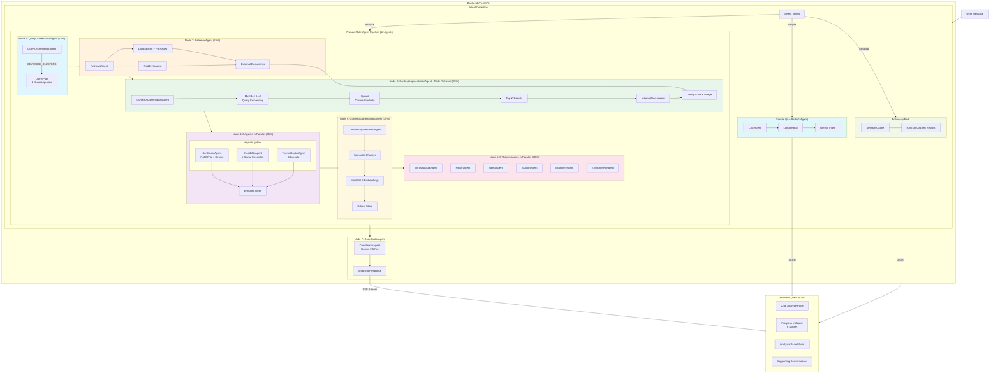
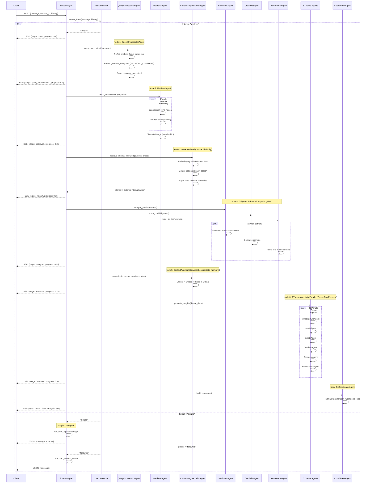
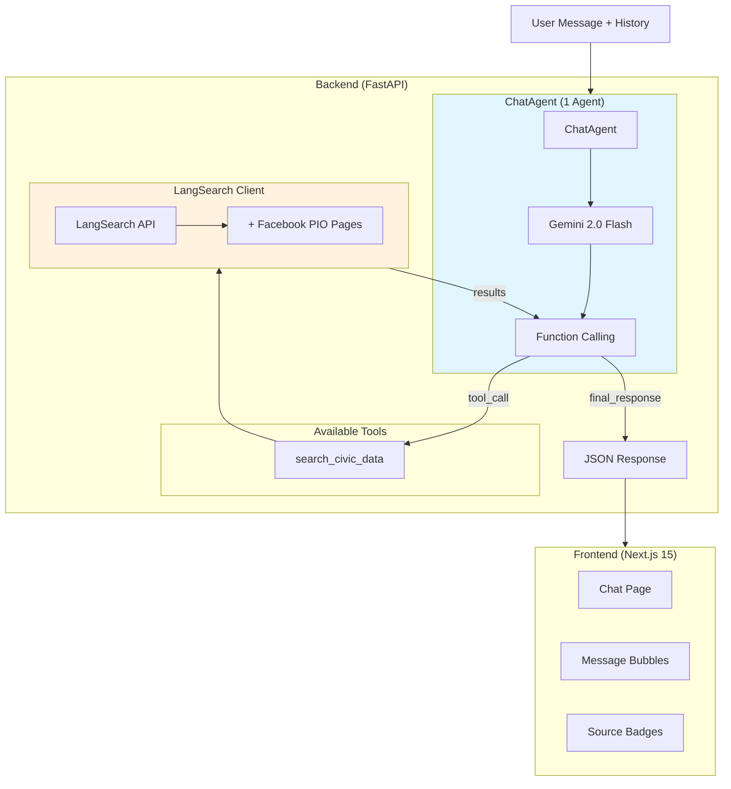
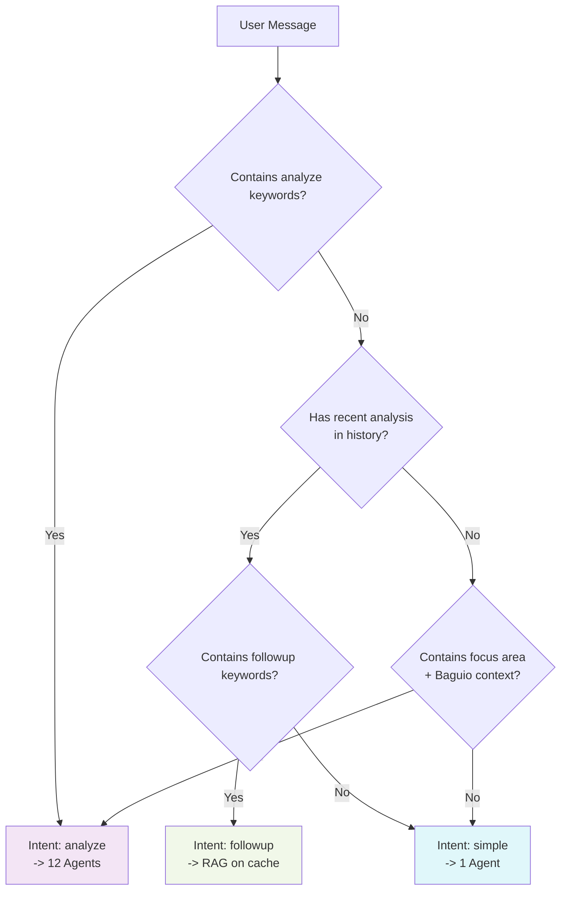
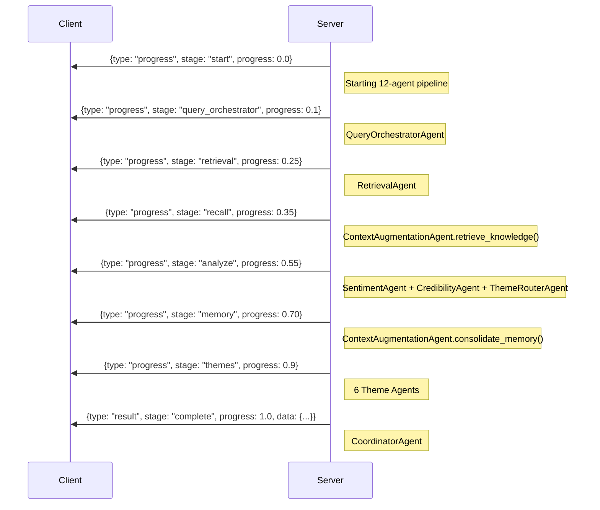
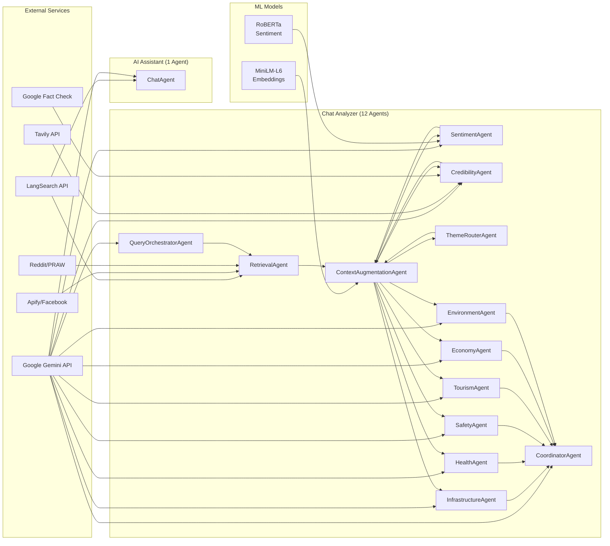
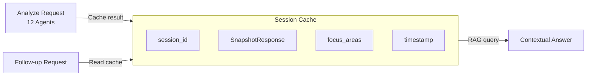

# Chat Systems Architecture

## Overview

Hinaing provides two distinct chat interfaces with different agent architectures:

| Feature | Chat Analyzer (12 Agents) | AI Assistant (1 Agent) |
|---------|---------------------------|------------------------|
| **Purpose** | Deep sentiment analysis | Quick Q&A |
| **Endpoint** | `POST /chat/analyze` | `POST /chat/` |
| **Response** | Streaming (SSE) | Sync JSON |
| **Agent Count** | **12** (6 core + 6 theme) | **1** (ChatAgent) |
| **Pipeline** | 7-node multi-agent | Single LLM + tool call |
| **Latency** | 15-30 seconds | 2-5 seconds |
| **Memory** | Persistent (Qdrant) | None |

## Agent Summary

### Chat Analyzer Agents (12 Total)

| Category | Count | Agents |
|----------|-------|--------|
| **Core Pipeline** | 6 | QueryOrchestratorAgent, RetrievalAgent, SentimentAgent, CredibilityAgent, ContextAugmentationAgent, ThemeRouterAgent |
| **Theme Sub-Agents** | 6 | InfrastructureAgent, HealthAgent, SafetyAgent, TourismAgent, EconomyAgent, EnvironmentAgent |

### AI Assistant Agent (1 Total)

| Agent | Function |
|-------|----------|
| **ChatAgent** | Single ReAct agent with LangSearch tool for quick Q&A |

---

## Chat Analyzer System Flow (12 Agents)



---

## Chat Analyzer Sequence Diagram (12 Agents)



---

## AI Assistant Architecture (1 Agent)



---

## Agent Comparison: Chat Analyzer vs AI Assistant

| Aspect | Chat Analyzer (12 Agents) | AI Assistant (1 Agent) |
|--------|---------------------------|------------------------|
| **QueryOrchestratorAgent** | ✅ ReAct with 3 tools | ❌ None |
| **RetrievalAgent** | ✅ LangSearch + FB + Reddit | ❌ LangSearch only (via tool) |
| **ContextAugmentationAgent** | ✅ Memory recall + consolidation | ❌ None |
| **SentimentAgent** | ✅ RoBERTa + Gemini ensemble | ❌ None |
| **CredibilityAgent** | ✅ 5-signal framework | ❌ None |
| **ThemeRouterAgent** | ✅ 6 theme buckets | ❌ None |
| **6 Theme Agents** | ✅ Parallel Gemini | ❌ None |
| **ChatAgent** | ❌ Not used | ✅ Single agent |
| **Memory** | ✅ Qdrant persistent | ❌ None |
| **Parallelization** | ✅ Nodes 4 + 6 | ❌ None |

---

## Intent Detection Logic



### Intent Keywords

| Intent | Keywords | Agent Path |
|--------|----------|------------|
| **analyze** | "analyze", "sentiment", "public opinion", "civic sentiment" | 12 Agents |
| **followup** | "tell me more", "explain", "why", "sources" | RAG on cache |
| **simple** | Default (no analysis keywords) | 1 Agent (ChatAgent) |

---

## Streaming Response Format (12 Agents)



---

## Component Architecture (12 Agents)



---

## Agent File Structure

```
backend/
├── app/
│   ├── routers/
│   │   ├── chat_analyze.py      # /chat/analyze - 12 Agents (Streaming SSE)
│   │   └── chat.py              # /chat/ - 1 Agent (Sync JSON)
│   ├── services/
│   │   ├── agents/
│   │   │   ├── chat_agent.py           # ChatAgent (AI Assistant)
│   │   │   ├── query_orchestrator.py   # QueryOrchestratorAgent
│   │   │   ├── sentiment_agent.py      # SentimentAgent
│   │   │   ├── credibility_agent.py    # CredibilityAgent
│   │   │   ├── context_agent.py        # ContextAugmentationAgent
│   │   │   ├── theme_agent.py          # 6 Theme Agents
│   │   │   └── gemini.py               # ReAct agent utilities
│   │   ├── insights/
│   │   │   ├── graph.py         # 7-Node LangGraph workflow
│   │   │   ├── agents.py        # RetrievalAgent, ThemeRouterAgent
│   │   │   └── agent_tools.py   # Tool implementations
│   │   ├── rag/
│   │   │   ├── chunker.py       # Semantic chunking
│   │   │   ├── embeddings.py    # MiniLM service
│   │   │   └── vector_store.py  # Qdrant client
│   │   ├── ingestion/
│   │   │   ├── reddit.py        # PRAW integration
│   │   │   └── facebook.py      # Apify integration
│   │   └── langsearch.py        # Web search + FB enrichment
```

---

## Performance Comparison

| Metric | Chat Analyzer (12 Agents) | AI Assistant (1 Agent) |
|--------|---------------------------|------------------------|
| Agent Count | **12** | **1** |
| Avg Latency | 15-30s | 2-5s |
| Documents Processed | Up to 100 | Up to 5 |
| LLM Calls | 8-12 | 1-2 |
| Streaming | Yes (SSE) | No |
| Memory | Persistent (Qdrant) | None |
| Sentiment Scoring | Yes (ensemble) | No |
| Credibility Scoring | Yes (5-signal) | No |
| Structured Output | Yes | Text + Sources |
| Parallelization | Nodes 4 + 6 | None |

---

## Session Management



Chat Analyzer maintains in-memory session cache:
- Stores analysis results by `session_id`
- Enables follow-up questions without re-running 12-agent pipeline
- Uses Gemini RAG on cached `SnapshotResponse`
